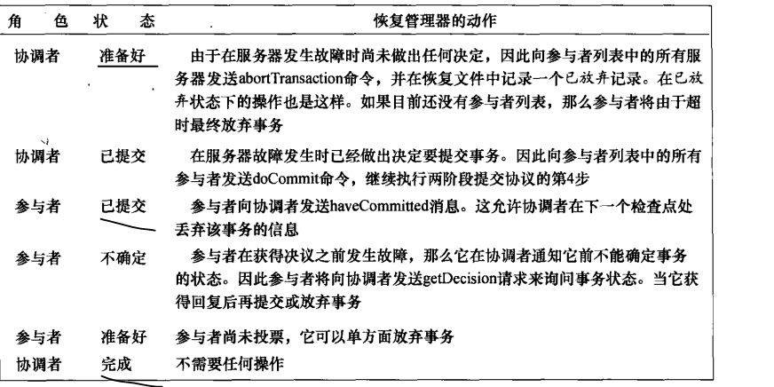
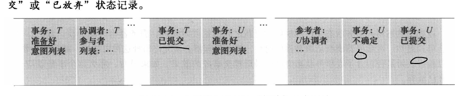

##  raft学习记录

### 一、这个技术出现的背景、初衷和要达到什么样的目标或是要解决什么样的问题

从集中式部署业务架构到 分布式部署，Master-Worker架构 改造过程中，必然涉及数据一致性问题

2pc，3pc都没很好解决这个问题，ZooKeeper 站出来解决这个问题。

- 应用的协调服务。

- 分布式应用的协调服务。

- 协调分布式应用的服务的服务(中间件)

> 使用**Zoo keeper** ，一个普通服务 做很少改造机就能升级为分布式服务，协调应用直接数据一致性问题。
>
> ZooKeeper is  coordination service for distributed applications.

ZooKeeper 是伴随Hadoop产生的， 而Hadoop生态系统中，很多项目都是以动物来命名，如Pig，Hive等， 似乎像一个动物园，这样就得到动物园管家的名称”ZooKeeper”

### 二、这个技术的优势和劣势分别是什么 

#### 劣势

- ### 服务缺乏可扩展性

微服务相关的项目都纷纷抛弃ZK转投etcd，可见其确实有可取之处，也可以看出一个项目的易用的重要性有时候甚至高于稳定性和功能

可扩展性不足，ZK集群不支持在线动态添加机器或替换机器

- 不适合用于大容量存储。

  > 对于大容量存储 ，我们完全可以考虑使用数据库或者分布式文件系统等

### 三、这个技术适用的场景。任何技术都有其适用的场景，离开了这个场景

　**Zookeeper** 是一个基于 [Google Chubby](https://static.googleusercontent.com/media/research.google.com/zh-CN//archive/chubby-osdi06.pdf) 论文实现的一款解决分布式数据一致性问题的开源实现，方便了依赖 Zookeeper 的应用实现 

- 数据发布 / 订阅

- 负载均衡

- 服务注册与发现

- 分布式协调

- 事件通知

- 集群管理

- Leader 选举

- 分布式锁和队列

### 四、技术的组成部分和关键点。

- ZAB 协议是为分布式协调服务 Zookeeper 专门设计的一种支持崩溃恢复的原子广播协议.专为ZK设计的

  > 2pc和3pc的分析中可以看出，出现不一致的情况都是因为执行rollback操作导致的，同步阻塞本来就性能差，而且还要等待所有的参与者回复才能做出决策，这导致性能更差。
  >
  > Zab在汲取了这些经验后，其在设计上不允许执行rollback操作，协调者(zab中是leader)发出的请求，参与者(zab中是Follower)要么同意，要么丢弃，且协调者在收到一半的回复后，就能做出决策，发出提交申请，同样在得到一半的回复后，能够完成事务
  >
  > zk很好的解决了2pc和3pc的各种问题，且也不会有单点问题

### 五、技术的底层原理和关键实现

### 六、已有的实现和它之间的对比

| 产品  | 一致性 | 角色                                                         | *Fail over*          |      |
| ----- | ------ | ------------------------------------------------------------ | -------------------- | ---- |
| 2pc   | ALL    | Coordinator(A准备好，B已经提交全部同意，C完成),  Participant（准备好，不确定阻塞，已经提交完成） | 不能解决网络分区问题 |      |
| Paxos |        |                                                              |                      |      |
|       |        |                                                              |                      |      |

- [Two-phase Commit](https://zh.wikipedia.org/wiki/%E4%BA%8C%E9%98%B6%E6%AE%B5%E6%8F%90%E4%BA%A4),第二阶段有叫做完成阶段，因为无论结果怎样，协调者都必须在此阶段结束当前事务。不重复第一阶段过程。

- [非常好的提问](https://www.zhihu.com/question/264701955)

~~~

场景如下：协调者C，参与者A，B等节点。节点发生故障后，可能一直挂掉也可能恢复，所以其他节点要继续执行事务，当故障节点恢复后，

如何保证所有参与者节点的一致性？

2PC下，
第一阶段，协调者C发送事务提议给A和B，A反馈no，B反馈yes
第二阶段，根据上一阶段反馈的信息，协调者C发送中止事务信息，当协调者C刚给A发送了事务中止信息后就挂掉了，A接收到中止信息，回滚时候后，也挂掉了。
这时，新的协调者D，无法获知A的事务是提交了还是回滚了，这样B无论是提交事务还是回滚事务都有可能造成数据不一致。

3PC下，
第一阶段，协调者C发送canCommit给A和B，A和B都反馈yes
第二阶段，协调者C发送preCommit给A和B，A反馈不成功，B反馈成功
第三阶段，根据上一阶段反馈的信息，协调者C发送中止事务信息，当协调者C刚给A发送了事务中止信息后就挂掉了，A接收到中止信息，回滚时候后，也挂掉了。这时，新的协调者D，无法获知A的事务是提交了还是回滚了，这样B无论是提交事务还是回滚事务都有可能造成数据不一致。
和2PC同样的问题，为什么网上都说3PC解决了这个问题，怎么解决的？不理解。

问题补充：

2PC做不到这点我理解，但是网上都在说3PC增加了preCommit阶段，解决了这个问题，现在还没明白3PC怎么解决了，还在查阅资料思考中。。。
关于网上对3PC如何解决这个问题的关键点就是所有存活的节点为preCommit状态的话，那故障节点就是可以提交的。
我不明白的地方就是，如果协调者C在第三阶段刚给A节点发送了abort还未给其他节点发送abort就挂掉了，A节点执行完回滚事务的操作后也挂掉了，现在其他存活的节点都是preCommit状态，新的协调者D进来后，查看存活的节点都是preCommit状体就让存活节点提交了事务，然后等故障节点A恢复后，A的事务是回滚的，数据就不一致了，不是和2PC一样没有解决问题么？

https://csruiliu.github.io/blog/20160530-intro-3pc/

2PC协议中，如果出现协调者和参与者都挂了的情况，有可能导致数据不一致

Consensus Protocols: Three-phase Commit
https://www.the-paper-trail.org/post/2008-11-29-consensus-protocols-three-phase-commit/
https://www.the-paper-trail.org/post/2008-11-27-consensus-protocols-two-phase-commit/
https://darktea.github.io/notes/2014/04/07/2PC.html
coordinator crashes 
在第一阶段，协调者故障，如果消息未发出，不会造成数据不一致。【在A之前不阻塞】
在第一阶段，协调者故障，部分受到信息不知道，部分没有受到，阻塞此处 【AB阻塞】
启动新的协调者，如果超时，需要查询其他参与者状态。

在第二阶段，也是如此

确定：

一个阻塞可能引起其他更多业务阻塞

二阶段提交算法的最大缺点就在于它的执行过程中间，节点都处于阻塞状态。
即节点之间在等待对方的响应消息时，它将什么也做不了。特别是，当一个节点在已经占有了某项资源的情况下，
为了等待其他节点的响应消息而陷入阻塞状态时，当第三个节点尝试访问该节点占有的资源时，这个节点也将连带陷入阻塞状态。

~~~

