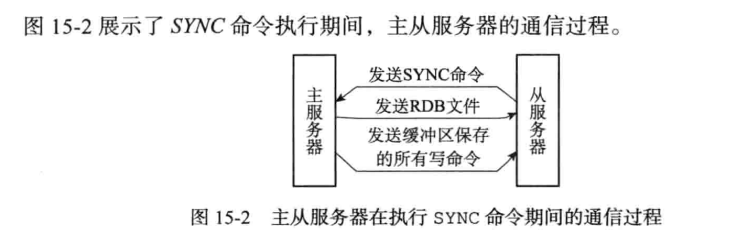
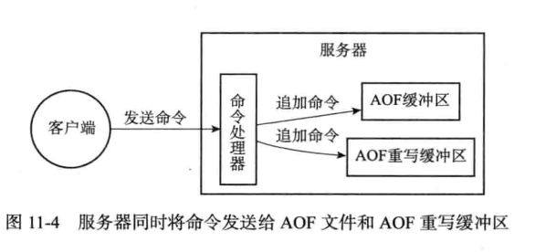

c

这就是你价值，用不一向的角度回答老问题。

> 别人回答了，那是入门时候，随笔写博客时候，应付项目时候。
>
> 别人迭代了，别人不会重写一本书，一个项目，一个博客纠正。
>
> 别人没有义务纠正你错误。
>
>  你对你认知负责，你需要对你理解负责


## 一、问题


- Nginx平滑升级
- SRS 平滑升级
- nginx 平滑升级
- Tidb升级


## 二、你的思考（10秒闪过

> 范围 代码，官方文档 和项目问题 指出内容


热备 考虑单点故障

集群是不怕单点故障的。


## 三、你的回答（限制在1分钟，5句话，12秒一句）


## 四、鸡蛋里挑骨头（第一句话回答关键了吗，后面有具体场景吗？或者关键词补充吗）

> 如果简单用法，100%保证不过关，因为没有骨头可挑！
>
> 如果自己强加各种特自己根本不理解很深入原理，你保证100个人 80人也说不出来
>
> 从哪里入手呢？
>
> 1 假如100个人去问，大家都问什么相同的题目。
>
> 2 别看不起官方文档，上面最全面。最正确，包含各种情况（大家关系问题在官方文档有答案）【文档每一行都要看，想当然不行的】
>
> 3 自己手动写小demo


## 五、你自己满意了吗,认为过关了

1. 10秒内单，如果大脑一片空白，对里面里面基础用法（不行）

2. 进一步 提问，原理，异常等毫无总结，（不行）

3. 你必须停下来深入看看看别人怎么做的（学习吧）


## 六、下一个问题是什么（这不是结束，只是一个系统的开始）

问题：

[新旧server进程切换时，如何保证client和server之间tcp长链不断？](https://zhuanlan.zhihu.com/p/97340154)

问题：多个进程如何监控同一个端口？

回答：

[通过 fork 创建子进程的方式可以实 其实我们只要在绑定端口号（bind函数）之后，监听端口号之前（listen函数）现，其他情况下不行](https://my.oschina.net/lenglingx/blog/1563116)


参考

- https://lwn.net/Articles/542629/
- http://c.biancheng.net/view/2345.html

Nginx vs Envoy vs Mosn 平滑升级原理解析

- https://man7.org/linux/man-pages/man2/bind.2.html tcp基本过程

- https://pubs.opengroup.org/onlinepubs/009696799/functions/bind.html[EADDRINUSE]

  The specified address is already in use.

  https://man7.org/linux/man-pages/man2/listen.2.html

### 问题：

**fork+execve** 用是什么？

有什么问题 

 leak file descriptors？

回答：

**Nginx 的平滑升级是通过 `fork` + `execve` 这种经典的处理方式来实现的**。准备升级时，Old Master 进程收到信号然后 `fork` 出一个子进程，注意此时这个子进程运行的依然是老的镜像文件。

紧接着这个子进程会通过 `execve` 调用执行新的二进制文件来替换掉自己，成为 New Master。

- exec ：执行fork 复制用户控件，然后替换用户空间。

- 在打开资源时候，指定选项

  In practice, the safest strategy is to *always* set `O_CLOEXEC` when a new file descriptor gets created;

  ```c
  set the close-on-exec flag
                for the duplicate file descriptor
                    
   Creating a file descriptor with the flag O_CLOEXEC marks the file descriptor to be closed when a new program gets executed. This automatically prevents file-descriptor leaks.
    来自rockdb 一段代码：  SetFD_CLOEXEC 函数
                    
  class PosixFileSystem : public FileSystem {
   public:
    PosixFileSystem();
  
    const char* Name() const override { return "Posix File System"; }
  
    ~PosixFileSystem() override {}
  
    void SetFD_CLOEXEC(int fd, const EnvOptions* options) {
      if ((options == nullptr || options->set_fd_cloexec) && fd > 0) {
        fcntl(fd, F_SETFD, fcntl(fd, F_GETFD) | FD_CLOEXEC);
      }
    }
  ```


- 多线程环境执行fork，可能只copy 主线程资源，其他子线程资源无法处理了。

参考：

Preventing file descriptor leaks to child processes 

- https://man7.org/linux/man-pages/man2/socket.2.html SOCK_CLOEXEC 

- https://man7.org/linux/man-pages/man2/open.2.html

- http://tzimmermann.org/2017/08/17/file-descriptors-during-fork-and-exec/
- https://docs.fedoraproject.org/en-US/Fedora_Security_Team/1/html/Defensive_Coding/sect-Defensive_Coding-Tasks-Descriptors-Child_Processes.html

close-on-exec FD_CLOEXEC

```
if (fcntl(fd, F_SETFD, FD_CLOEXEC) == -1) {

Unfortuantely, there is also one major drawback of this whole design. It’s too easy to leak file descriptors into a newly executed program. That’s what happened here.
```

- https://man7.org/linux/man-pages/man2/fcntl.2.html

It sets the *close-on-exec* flag for the file descriptor, which causes the file descriptor to be automatically (and atomically) closed when any of the `exec`-family functions succeed.


问题：多个进程如何监控同一个端口？


## 七、如果自己没有做过类型项目，参考别人经验，自己重新设计，需要考虑知识点是什么？


### 八、如果自己没有做过类型项目，参考别人经验，自己直接写demo，和真是项目最大差距是什么？


~~~
那么问题来了：New Master 启动时按理说会执行bind+listen等操作来初始化监听，而这时候 Old Master 还没有退出，端口未释放，执行execve时理论上应该会报：Address already in use错误，但是实际上这里却没有任何问题，这是为什么？

因为 Nginx 在 `execve` 的时候压根就没有重新 `bind` + `listen`，而是直接把 listener fd 添加到 `epoll` 的事件表。因为这个 New Master 本来就是从 Old Master 继承而来，自然就继承了 Old Master 的 listener fd，但是这里依然有一个问题：该怎么通知 New Master 呢？

环境变量。execve在执行的时候可以传入环境变量。实际上 Old Master 在fork之前会将所有 listener fd 添加到NGINX环境变量：


端口重用错误理解：
http://blog.lifeibo.com/blog/2011/09/09/port-reuse.html
SO_REUSEADDR可以用在以下四种情况下。
(摘自《Unix网络编程》卷一，即UNPv1)
1、当有一个有相同本地地址和端口的socket1处于TIME_WAIT状态时，而你启
动的程序的socket2要占用该地址和端口，你的程序就要用到该选项。
2、SO_REUSEADDR允许同一port上启动同一服务器的多个实例(多个进程)。但
每个实例绑定的IP地址是不能相同的。在有多块网卡或用IP Alias技术的机器可
以测试这种情况。
3、SO_REUSEADDR允许单个进程绑定相同的端口到多个socket上，但每个soc
ket绑定的ip地址不同。这和2很相似，区别请看UNPv1。
4、SO_REUSEADDR允许完全相同的地址和端口的重复绑定。但这只用于UDP的
多播，不用于TCP。


~~~


[腾讯会议用户暴涨，Redis 集群如何实现无缝扩容？](https://mp.weixin.qq.com/s/nKCw_a5mU9sn7SPKmCn-OQ)

1. 无损扩容挑战--大 Key 问题

> 一个 list 也是一个 Key，一个哈希表也是 Key，一个 list 会有上千万的数据，一个哈希表也会有很多的数据
>
> 一般 Redis 业务设置超时大部分是 200 毫秒，有的是 100 毫秒。
>
> 如果同步搬移 Key 超过一秒，就会有大量的超时出现，客户业务就会慢。


DTS直接利用sync命令 ，全量同步，然后增量同步

腾讯采取是带slot sync，也是fork  全量slot ，然后增量slot 


我晕 一个带slot sync  一个直接sync区别。其实过程还是一样的。

文章说到2 倍的资源。DTS是原生命令，mysql dump时候不可能fork，只有redis才有。

都是利用redis特性。


SRS配置完全支持Reload，即在不中断服务时应用配置的修改。

## https://juejin.im/post/5df6f65b51882512727f2607


https://www.lbbniu.com/8153.html

**平滑升级的本质就是 listener fd 的迁移**

**Nginx 的平滑升级是通过fork+execve这种经典的处理方式来实现的**。


**slot产生过程中产生新数据怎么同步？**

**A：**类似aof概念的机制同步到目标进程。这个aof跟普通aof传输到slave有区别，只会将跟目标slot相关的数据同步过去，而不会同步别的。


sync命令 






- replicaof <masterip> <masterport>  
- 用管道代替socket aof_pipe_write_data_to_child
- [aofChildWriteDiffData](http://mysql.taobao.org/monthly/2018/12/06/)

~~~c
 while (1)
    {
        ln = listFirst(server.aof_rewrite_buf_blocks);
        block = ln ? ln->value : NULL;
        if (server.aof_stop_sending_diff || !block)
        {
            aeDeleteFileEvent(server.el, server.aof_pipe_write_data_to_child,
                              AE_WRITABLE);
            return;
        }
        if (block->used > 0)
        {
            nwritten = write(server.aof_pipe_write_data_to_child,
                             block->buf, block->used);
            if (nwritten <= 0)
                return;
            memmove(block->buf, block->buf + nwritten, block->used - nwritten);
            block->used -= nwritten;
            block->free += nwritten;
        }
        if (block->used == 0)
            listDelNode(server.aof_rewrite_buf_blocks, ln);
    }
~~~

http://mysql.taobao.org/monthly/2018/12/06/

https://developpaper.com/aof-rewriting-for-redis-persistence/