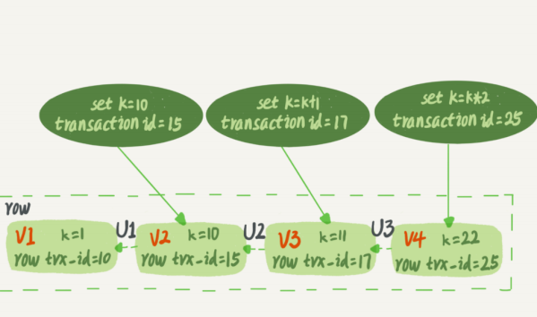
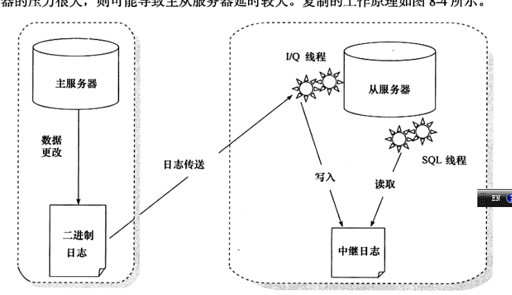
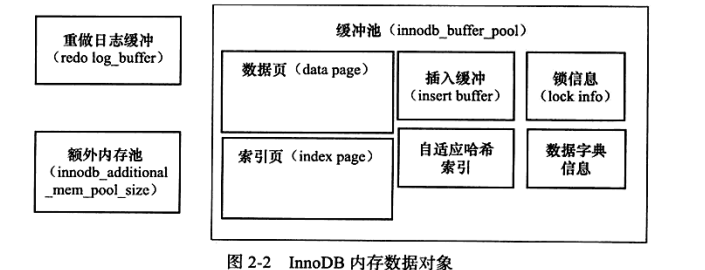

- 


- https://juejin.im/post/6844903773203070983 Redis集群一致性Hash效果的代码演示

- https://testerhome.com/topics/12175/show_wechat 30分钟


- 27 | 主库出问题了，从库怎么办？

在一主多从架构下，主库故障后的主备切换问题。


问：一致性hash和redis集群hash差别 ？很多人都说不一样，

答：一致性哈希算法（2^32） 和redis 16384（2^14）拆分数据，在这方面其实没有什么差别

 差别前者是机器均分的 这些key，后者16384都是虚拟节点来拆分分摊到具体机器上。其实都是虚拟一致性hash

前者通过代理来实现。后者通过db本身实现。这个主要区别吧。


](https://segmentfault.com/img/bVbwQCJ)


问题 4：如果 binlog 写完盘以后发生 crash，这时候还没给客户端答复就重启了。等客户 端再重连进来，发现事务已经提交成功了，这是不是 bug？

 回答：不是。 你可以设想一下更极端的情况，整个事务都提交成功了，redo log commit 完成了，备库 也收到 binlog 并执行了。

但是主库和客户端网络断开了，导致事务成功的包返回不回 去，这时候客户端也会收到“网络断开”的异常。

这种也只能算是事务成功的，不能认为 是 bug。 

实际上数据库的 crash-safe 保证的是： 

1. 如果客户端收到事务成功的消息，事务就一定持久化了； 
2. 如果客户端收到事务失败（比如主键冲突、回滚等）的消息，事务就一定失败了； 
3. 3. 如果客户端收到“执行异常”的消息，应用需要重连后通过查询当前状态来继续后续的 逻辑。此时数据库只需要保证内部（数据和日志之间，主库和备库之间）一致就可以 了。


- “快照”在 MVCC 里是怎么工作的？

https://www.jianshu.com/p/42330b3f64f1

[https://zouchanglin.cn/2020/02/27/InnoDB%E7%A7%92%E7%BA%A7%E5%BF%AB%E7%85%A7%E5%8E%9F%E7%90%86%E4%B8%8E%E5%BD%93%E5%89%8D%E8%AF%BB/](https://zouchanglin.cn/2020/02/27/InnoDB秒级快照原理与当前读/)

Multi-Version Concurrency Control 多版本[并发控制](https://baike.baidu.com/item/并发控制/3543545)，MVCC 是一种并发控制的方法，一般在数据库管理系统中，实现对数据库的并发访问；在编程语言中实现事务内存。

在可重复读隔离级别下，事务在启动的时候就“拍了个快照”。

注意，这个快照是基于整 库的。 这时，你会说这看上去不太现实啊。

如果一个库有 100G，那么我启动一个事务，MySQL 就要拷贝 100G 的数据出来，这个过程得多慢啊。

可是，我平时的事务执行起来很快啊。




实际上，图 2 中的三个虚线箭头，就是 undo log；而 V1、V2、V3 并不是物理上真实存 在的，而是每次需要的时候根据当前版本和 undo log 计算出来的。比如，需要 V2 的时 候，就是通过 V4 依次执行 U3、U2 算出来。




# 部署安装


## [yum安装mysql 5.6](https://segmentfault.com/a/1190000007667534)(centos 6)

- 对系统版本要求低，5.7要求高

https://segmentfault.com/a/1190000007667534

~~~mysql
create database test;
~~~


~~~shell
centos6.8
yum -y install mysql mysql-server mysql-devel //从yum库中的安装mysql
rpm -qi mysql-server //验证是否安装成功
 service mysqld start //启动mysql服务
输入命令： 
 mysql -u root
mysql -u root -p

建立远程root用户

GRANT ALL PRIVILEGES ON *.* TO 'root'@'%' IDENTIFIED BY '123456' WITH GRANT OPTION;

flush privileges;

修改密码
更改mysql密码，要FLUSH PRIVILEGES; 才生效
mysql -u root 
mysql> use mysql; 
mysql> update user set password=password('123456') where user='root'; 
mysql> FLUSH PRIVILEGES; 
mysql> quit; 
# service mysqld restart

mysql -u root -p  123456

sudo apt-get install mysql-client mysql-server
sudo service mysql status
sudo service mysqld start

/etc/init.d/networking restart
select user, plugin from mysql.user;	
update mysql.user set authentication_string=PASSWORD('123456'), plugin='mysql_native_password' where user='root';

~~~


~~~shell

 mysql> create database  dream;
Query OK, 1 row affected (0.01 sec)

mysql> use dream;
Database changed

mysql+5.7+设置远程登录
在ubuntu14.04上安装好mysql5.7之后，本地可以连接mysql服务器。
远程就不行。

注释掉在/etc/mysql/mysql.conf.d/mysqld.cnf里面的bind-address = 127.0.0.1

GRANT ALL PRIVILEGES ON *.* TO 'root'@'%' IDENTIFIED BY 'root' WITH GRANT OPTION;

~~~

## ubuntu mysql 5.7(centos7)

https://cloud.tencent.com/developer/article/1392435

~~~shell
sudo apt-get autoremove --purge mysql-server-5.0
sudo apt-get remove mysql-server
sudo apt-get autoremove mysql-server
sudo apt-get remove mysql-common //这个很重要
上面的其实有一些是多余的
dpkg -l |grep ^rc|awk '{print $2}' |sudo xargs dpkg -P
sudo apt-get install mysql-server
sudo apt-get install mysql-client
sudo apt-get install php5-mysql 
// 安装php5-mysql 是将php和mysql连接起来
一旦安装完成，MySQL 服务器应该自动启动。您可以在终端提示符后运行以下命令来检查 MySQL 服务器是否正在运行：
sudo netstat -tap | grep mysql

 mysql -V
mysql  Ver 14.14 Distrib 5.7.29, for Linux (x86_64) using  EditLine wrapper
root@work:~# 


mysqladmin -uroot -p password 123456 


#查看mysql状态
/etc/init.d/mysql status 或者 service mysql status
#启动mysql
/etc/init.d/mysql start 或者 service mysql start
#停止mysql
/etc/init.d/mysql stop 或者 service mysql stop
#重新启动mysql
/etc/init.d/mysql restart 或者 service mysql restart
查看mysql服务说明启动成功

————————————————
版权声明：本文为CSDN博主「南有乔木灬」的原创文章，遵循 CC 4.0 BY-SA 版权协议，转载请附上原文出处链接及本声明。
原文链接：https://blog.csdn.net/wudawei071193/java/article/details/100777206

 /etc/init.d/networking restart
~~~


# 


# 案例

## 第一天


- 请使用一条语句 统计各班的男生和女生人数

SELECT class_id, gender, COUNT(*) num FROM students GROUP BY class_id, gender;

请使用一条SELECT查询查出每个班级男生和女生的平均分：

```mysql
select class_id, gender,AVG(score)
 from students
 group by class_id,gender
 
https://www.liaoxuefeng.com/wiki/1177760294764384/1179611448454560

https://github.com/michaelliao/learn-sql/blob/master/mysql/init-test-data.sql
```


~~~mysql

mysql> explain select class_id, gender,AVG(score)
    ->  from students
    ->  group by class_id,gender;
+----+-------------+----------+------+---------------+------+---------+------+------+---------------------------------+
| id | select_type | table    | type | possible_keys | key  | key_len | ref  | rows | Extra                           |
+----+-------------+----------+------+---------------+------+---------+------+------+---------------------------------+
|  1 | SIMPLE      | students | ALL  | NULL          | NULL | NULL    | NULL |   10 | Using temporary; Using filesort |
+----+-------------+----------+------+---------------+------+---------+------+------+---------------------------------+
1 row in set (0.00 sec)


~~~


- show variables like 'innodb_buffer_pool_size'

~~~mysql
mysql> show variables like 'innodb_buffer_pool_size';
+-------------------------+-----------+
| Variable_name           | Value     |
+-------------------------+-----------+
| innodb_buffer_pool_size | 134217728 |
+-------------------------+-----------+
1 row in set (0.00 sec)
~~~





show variables like 'innodb_log_buffer_pool_size'

show variables like 'innodb_flush_log_at_trx_commit'


innodb_flush_log_at_trx_commit

- show engine innodb status;

  ~~~
  I/O thread 0 state: waiting for completed aio requests (insert buffer thread)
  I/O thread 1 state: waiting for completed aio requests (log thread)
  I/O thread 2 state: waiting for completed aio requests (read thread)
  I/O thread 3 state: waiting for completed aio requests (read thread)
  I/O thread 4 state: waiting for completed aio requests (read thread)
  I/O thread 5 state: waiting for completed aio requests (read thread)
  I/O thread 6 state: waiting for completed aio requests (write thread)
  I/O thread 7 state: waiting for completed aio requests (write thread)
  I/O thread 8 state: waiting for completed aio requests (write thread)
  I/O thread 9 state: waiting for completed aio requests (write thread)
  ~~~

   

  这个**副作用**，就是可能丢失数据：

  （1）事务提交时，将redo log写入Log Buffer，就会认为事务提交成功；

  *
  *（2）如果写入Log Buffer的数据，write入OS cache之前，数据库崩溃，就会出现数据丢失；

  

  （3）如果写入OS cache的数据，fsync入磁盘之前，操作系统奔溃，也可能出现数据丢失；

  *画外音：**如上文所说，应用程序系统调用完**write**之后（不可能每次**write**后都立刻**flush**，这样写日志很蠢），就认为写成功了，操作系统何时**fsync**，应用程序并不知道，如果操作系统崩溃，数据可能丢失。*

innodb_flush_log_at_trx_commit

 

目前有**三种策略**：


**策略一：最佳性能**(innodb_flush_log_at_trx_commit=0)

每隔一秒，才将Log Buffer中的数据批量write入OS cache，同时MySQL主动fsync。

这种策略，如果数据库奔溃，有一秒的数据丢失。

 

**策略二：强一致**(innodb_flush_log_at_trx_commit=1)

每次事务提交，都将Log Buffer中的数据write入OS cache，同时MySQL主动fsync。

这种策略，是InnoDB的默认配置，为的是保证事务ACID特性。

 

**策略三：折衷**(innodb_flush_log_at_trx_commit=2)

每次事务提交，都将Log Buffer中的数据write入OS cache；

每隔一秒，MySQL主动将OS cache中的数据批量fsync。


~~~
mysql> show variables like 'innodb_flush_log_at_trx_commit';
+--------------------------------+-------+
| Variable_name                  | Value |
+--------------------------------+-------+
| innodb_flush_log_at_trx_commit | 1     |
+--------------------------------+-------+
~~~

- 为什么我的MySQL会“抖”一下？.pdf

做下类比的话，掌柜记账的账本是数据文件，

记账用的粉板是日志文件（redo log），

掌 柜的记忆就是内存


InnoDB的**主键索引与**行记录是存储在一起的，故叫做**聚集索引**（Clustered Index）：

- 没有单独区域存储行记录
- 主键索引的叶子节点，存储主键，与对应行记录（而不是指针）

*画外音：因此，InnoDB的PK查询是非常快的。*

 

innoDB一定有且只有一个聚集索引

MyISAM的索引与数据分开存储


(3)非叶子节点，不存储实际记录，而只存储记录的KEY的话，那么在相同内存的情况下，B+树能够存储更多索引；

 

最后，量化说下，**为什么m叉的B+树比二叉搜索树的高度大大大大降低？**

大概计算一下：

(1)局部性原理，将一个节点的大小设为一页，一页4K，假设一个KEY有8字节，一个节点可以存储500个KEY，即j=500

(2)m叉树，大概m/2<= j <=m，即可以差不多是1000叉树

(3)那么：

一层树：1个节点，1*500个KEY，大小4K

二层树：1000个节点，1000*500=50W个KEY，大小1000*4K=4M

三层树：1000*1000个节点，1000*1000*500=5亿个KEY，大小1000*1000*4K=4G

*画外音：额，帮忙看下有没有算错。*

*
*

可以看到，存储大量的数据（5亿），并不需要太高树的深度（高度3），索引也不是太占内存（4G）。

- **Covering index)**

 Using index condition


结果说明：

Extra为Using index condition说明，确实命中了索引，但不是所有的列数据都在索引树上，还需要访问实际的行记录。

*画外音：**聚集索引，普通索引的底层实现差异，详见《**[1分钟了解MyISAM与InnoDB的索引差异](http://mp.weixin.qq.com/s?__biz=MjM5ODYxMDA5OQ==&mid=2651961494&idx=1&sn=34f1874c1e36c2bc8ab9f74af6546ec5&chksm=bd2d0d4a8a5a845c566006efce0831e610604a43279aab03e0a6dde9422b63944e908fcc6c05&scene=21#wechat_redirect)》。*

 

这类SQL语句性能也较高，但不如Using index。

 

**问题来了，如何优化为Using index呢？**


Using index不读数据文件，只从索引文件获取数据


Extra为Using index condition说明，确实命中了索引，但不是所有的列数据都在索引树上，还需要访问实际的行记录。

*画外音：**聚集索引，普通索引的底层实现差异，详见《**[1分钟了解MyISAM与InnoDB的索引差异](http://mp.weixin.qq.com/s?__biz=MjM5ODYxMDA5OQ==&mid=2651961494&idx=1&sn=34f1874c1e36c2bc8ab9f74af6546ec5&chksm=bd2d0d4a8a5a845c566006efce0831e610604a43279aab03e0a6dde9422b63944e908fcc6c05&scene=21#wechat_redirect)》。*


MySQL 将需要排序的数据分成 12 份，每一份单独排序后存在这些临 时文件中。然后把这 12 个有序文件再合并成一个有序的大文件。

Extra 字段里面多了“Using index”，表示的就是使用了覆盖索引，性能上会


sort_buffer_size，就是 MySQL 为排序开辟的内存（sort_buffer）的大小。如果要排序 的数据量小于 sort_buffer_size，排序就在内存中完成。但如果排序数据量太大，内存放 不下，则不得不利用磁盘临时文件辅助排序


# 测试数据

- 第一天

~~~mysql


 CREATE  TABLE `t` (

  `id` int(11) NOT NULL,

  `c` int(11) DEFAULT NULL,

  PRIMARY KEY (`id`)

) ENGINE=InnoDB;


create table user (

id int primary key,

name varchar(20),

sex varchar(5),

index(name)

)engine=innodb;

 

insert into user values(1, 'shenjian','no');

insert into user values(2, 'zhangsan','no');

insert into user values(3, 'lisi', 'yes');

insert into user values(4, 'lisi', 'no');
https://mp.weixin.qq.com/s?__biz=MjM5ODYxMDA5OQ==&mid=2651962587&idx=1&sn=d197aea0090ce93b156e0774c6dc3019&chksm=bd2d09078a5a801138922fb5f2b9bb7fdaace7e594d55f45ce4b3fc25cbb973bbc9b2deb2c31&scene=21#wechat_redirect

create table t1(id int primary key, a int, b int, index(a));

delimiter ;;
create procedure idata()
begin
declare i int;
set i=1;
while(i<=1000)do
insert into t1 values(i, i, i);
set i=i+1;
end while;
end;;
delimiter ;
call idata();
~~~


~~~mysql
CREATE TABLE `teacher` (
  `id` int(11) NOT NULL AUTO_INCREMENT,
  `name` varchar(32) NOT NULL,
  `age` int(11) NOT NULL,
  PRIMARY KEY (`id`)
) ENGINE=InnoDB AUTO_INCREMENT=3 DEFAULT CHARSET=utf8mb4;

INSERT  INTO teacher(id,NAME,age) VALUES (1,'seven',18);
INSERT  INTO teacher(id,NAME,age) VALUES (2,'qingshan',20);


create table dream.user(
   id int auto_increment,
   id_card VARCHAR(1000) NOT NULL,
   name VARCHAR(1000) NOT NULL,
   age int,
   PRIMARY KEY (`id`),
   INDEX(`name`)
)ENGINE=InnoDB DEFAULT CHARSET=utf8;


insert into user(id_card,name,age) values('429006xxxxxxxx2134','张三',22),('429006xxxxxxxx2135','李四',26),('129006xxxxxxxx3136','王五',28),('129106xxxxxxxx3337','赵六',17),('129106xxxxxxxx3349','孙XX',43),('129106xxxxxxxx3135','马大哈',39),('129106xxxxxxxx3134','王一',55),('139106xxxxxxxx2236','张三',7),('139106xxxxxxxx2130','张三',31),('439106xxxxxxxx2729','张三',29),('439106xxxxxxxx2734','李明',78),('429106xxxxxxxx1734','张三',96),('129106xxxxxxxx1737','张三',89),('129106xxxxxxxx1132','张三',3),('129106xxxxxxxx1197','张三',11),('129106xxxxxxxx1184','张三',14);


ALTER TABLE user ADD INDEX id_card_name_age (`name`,`age`);

show index from user;

show index from user;
 select * from information_schema.optimizer_trace \G;
explain select name,age from user order by name, age  \G;


explain select id_card,name,age from user order by age limit 3 \G


ALTER TABLE user ADD INDEX id_card_name_age (`name`,`age`);
explain select name,max(age)from user group by name,age  \G;

mysql> explain select max(age)from user group by age  \G;
*************************** 1. row ***************************
           id: 1
  select_type: SIMPLE
        table: user
   partitions: NULL
         type: index
possible_keys: id_card_name_age
          key: id_card_name_age
      key_len: 3007
          ref: NULL
         rows: 17
     filtered: 100.00
        Extra: Using index; Using temporary; Using filesort
1 row in set, 1 warning (0.01 sec)

ERROR: 
No query specified

 CREATE TABLE `t` (
`id` int(11) NOT NULL,
`k` int(11) DEFAULT NULL,
PRIMARY KEY (`id`)
) ENGINE=InnoDB;
insert into t(id, k) values(1,1),(2,2);
~~~


# bug

- [mysql重启后或者第二天创建表不存在了](https://blog.csdn.net/weixin_43979716/article/details/105783805?utm_medium=distribute.pc_relevant.none-task-blog-baidujs-1)

  

