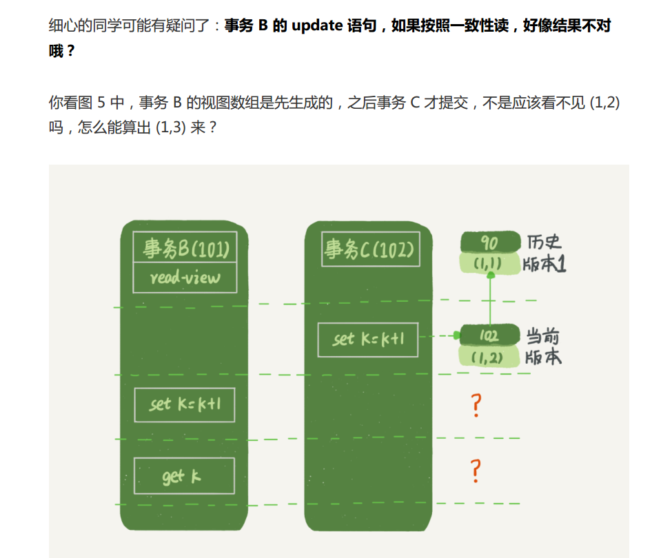
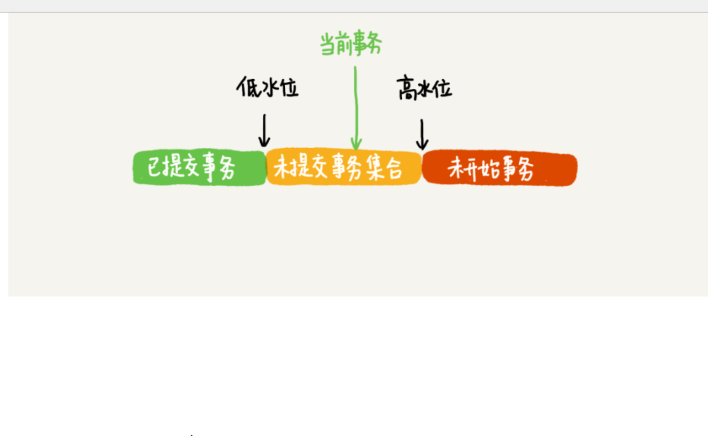

meir数据库事务的实现原理是什么?

数据库事务的实现原理是什么?

数据库事务的实现原理是什么?

每日一题：数据库事务的实现原理是什么 ?

## 我的状态：

A :提问者

数据库事务的实现原理是什么?

B:回答者

这个我张开口无法说起,如大海捞针，

实现原理

应该是神秘，应该是高深，

一鸣惊人的，醒醒吧，你不是创造一个数据库。

实现原理 ，也绝不会这么回答的。

你根本描述不清楚，思路错误了，

>  你从看到听到学到中寻找蛛丝马迹

## 我的理解

1. 首先想到ACID（atomicity,consistency,isolation,durability）

- 原子性 ，一致性，隔离性（并发控制，锁），持久性 
- 最重要一个特征是什么，当初只有一台普通128K内存机器，考虑的D

2. 然后只考虑 日志，围绕日志相关概念。

- 日志先行(WAL, Write Ahead Log)。包含2部分 日志缓冲区buffer，os cache，
   
     重做日志文件 log，三层架构，做事务时候，提前写log。执行fsync
   
   - undo log 作用 [MVCC](https://en.wikipedia.org/wiki/Multiversion_concurrency_control)(Multi version Concurrency Control  多线程服务) ,事务回滚 ，逻辑日志
   
   - redo log 事务持久性，顺序写入,物理日志
   
   - binglog 是记录上层SQL语句，一次性写入，解决Master-Slave数据进行同步问题
   
     Slave增量方式回放。
   
   - 重点就是MVCC如何实现的。
   
   
   
   3. MVCC（可重复读）
   
   - 多版本并不是直接存储多个版本的数据。
   - 当快照读的时候，利用Undo log重建需要读取版本的数据
   - 更新数据都是先读后写的，而这个读，只能读当前的
     值，称为“当前读”（current read）  
   
   

## 思考与行动

-    SQLite，是一款轻型的数据库，是遵守ACID的关系数据库管理系统 查看如何实现的

   区别于其他数据库引擎，SQLite引擎不是一个独立的进程

- 

## 肩膀

- MySQL技术内幕：InnoDB存储引擎
- 08 事务到底是隔离的还是不隔离的？
- [SQlite源码分析](https://huili.github.io/index.html) 

- https://mp.weixin.qq.com/s/syli7vs7Jw_VOTl5B2YUqg
- https://amao12580.github.io/post/2016/06/What-is-a-transaction/

- https://stackoverflow.com/questions/45558837/mysql-repeatable-read-get-other-sessions-commit-when-use-select-for-update

InnoDB的多版本并不是直接存储多个版本的数据，而是所有更改操作利用行锁做并发控制，这样对某一行的更新操作是串行化的，然后用Undo log记录串行化的结果。

当快照读的时候，利用Undo log重建需要读取版本的数据，从而实现读写并发。

**总结**
一、为了保证事务的ACID特性，理论上每次事务提交都应该刷盘，但此时效率很低，有两种优化方向：
（1）随机写优化为顺序写；
（2）每次写优化为批量写；

二、redo log是一种顺序写，它有三层架构：
（1）MySQL应用层：Log Buffer
（2）OS内核层：OS cache
（3）OS文件：log file

三、为了满足不用业务对于吞吐量与一致性的需求，MySQL事务提交时刷redo log有三种策略：
（1）0：每秒write一次OS cache，同时fsync刷磁盘，性能好；
（2）1：每次都write入OS cache，同时fsync刷磁盘，一致性好；
（3）2：每次都write入OS cache，每秒fsync刷磁盘，折衷；

四、高并发业务，行业内的最佳实践，是：
innodb_flush_log_at_trx_commit=2

~~~
# if set to 1 , InnoDB will flush (fsync) the transaction logs to the
# disk at each commit, which offers full ACID behavior. if you are willing to compromise this safety,

# and you are running small transactions , you may set this to 0 or 2 to reduce disk I/O to the logs,

# Value 0 means that the log is only written to the log file and the log file flushed to disk approximately once per second. 

# Value 2 means the log is written to the log file at each commit , but the log file is only flushed to disk approximately once per second
innodb_flush_log_at_trx_commit =1
~~~

redo log的三层架构？

花了一个丑图，简单说明下redo log的三层架构：

- **粉色**，是InnoDB的一项很重要的内存结构(In-Memory Structure)，日志缓冲区(Log Buffer)，这一层，是MySQL应用程序用户态
- **屎黄色**，是操作系统的缓冲区(OS cache)，这一层，是OS内核态
- **蓝色**，是落盘的日志文件

操作系统为什么要缓冲数据到OS cache里，而不直接刷盘呢？

这里就是将“每次写”优化为“批量写”，以提高操作系统性能。

 

**数据库为什么要缓冲数据到**Log Buffe里，而不是直接write呢？

这也是“每次写”优化为“批量写”思路的体现，以提高数据库性能。

画外音：这个优化思路，非常常见，高并发的MQ落盘，高并发的业务数据落盘，都可以使用。

MySQL有一个参数：

innodb_flush_log_at_trx_commit

能够控制事务提交时，刷redo log的策略。

前有**三种策略**：

**策略一：最佳性能**(innodb_flush_log_at_trx_commit=0)

每隔一秒，才将Log Buffer中的数据批量write入OS cache，同时MySQL主动fsync。

这种策略，如果数据库奔溃，有一秒的数据丢失。

 

**策略二：强一致**(innodb_flush_log_at_trx_commit=1)

每次事务提交，都将Log Buffer中的数据write入OS cache，同时MySQL主动fsync。

这种策略，是InnoDB的默认配置，为的是保证事务ACID特性。

 

**策略三：折衷**(innodb_flush_log_at_trx_commit=2)

每次事务提交，都将Log Buffer中的数据write入OS cache；

每隔一秒，MySQL主动将OS cache中的数据批量fsync。

*画外音：**磁盘IO次数不确定，因为操作系统的fsync频率并不是MySQL能控制的。*

这种策略，如果操作系统奔溃，最多有一秒的数据丢失。

*画外音：**因为OS也会fsync，MySQL主动fsync的周期是一秒，所以最多丢一秒数据。*

>  分享最实用的经验 ， 希望每一位来访的朋友都能有所收获！
>
> 不保证一定正确，如果更好方式，疑问，请联系我

