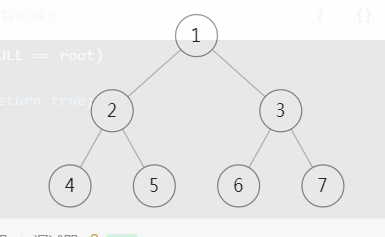
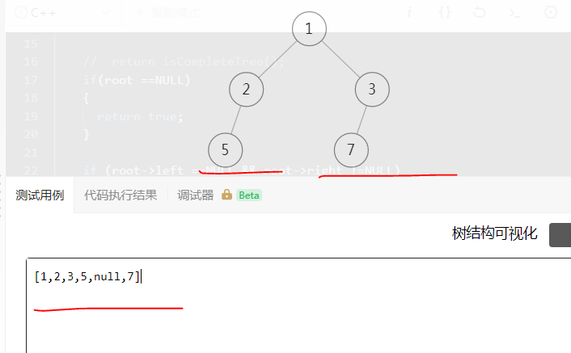
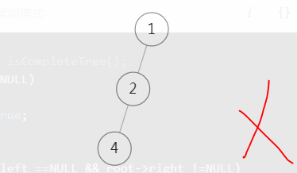
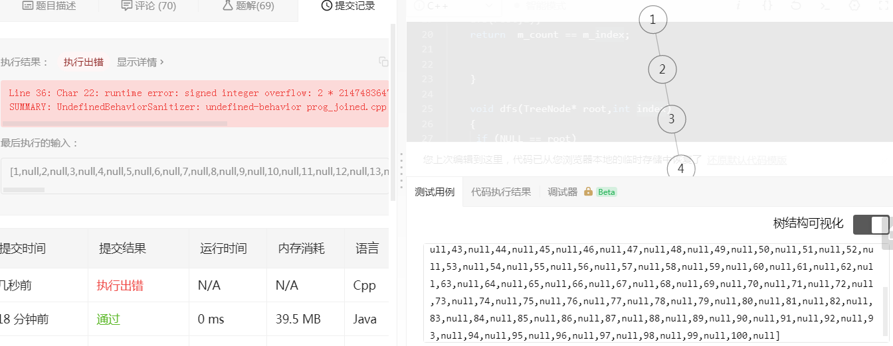

#### [958. 二叉树的完全性检验](https://leetcode-cn.com/problems/check-completeness-of-a-binary-tree/)

### 一、描述

给定一个二叉树，确定它是否是一个***完全二叉树***。

思考 60秒 。。。

思考 60秒 。。

 这个题目试从画图开始。

算法五个重要的特征：

- 输入项，输出项（题目已经给了）

- 可行性（复杂问题转化成熟悉子问题）

- 有穷性（在算法描述体现）

- 确切性（在算法描述体现）

### 二、思路

-  逻辑视图

~~~shell
输入：[1,2,3,4,5,null,7]
输出：false
解释：值为 7 的结点没有尽可能靠向左侧
~~~

#### 熟悉子问题

- 我第一眼就看出 上面例子更不是完全二叉树，5和7之间 存在null？但是无法用程序语言描述出？【如何全部遍历】

- 根据观察 层次遍历，遇到null，后面还有记录，不对了，**设立flag， 如果队还有记录，在遇到有记录的肯定不对。**【有遗漏不对】

- 从物理视图变成逻辑视图，完全利用满二叉树性质，想想堆排序。**关键是怎么判断呢**？

  

  

  

  

  假如完全二叉树，7的编号就是7没有问题，

  >  编号是7，tree的中长度为7。

  

  - 不是完全二叉树的编号也是7，总长度是6。

  

  

  

#### 这样做那里不对？

- bug1 我们只需要检查最后一个编号是否正确，因为最后一个编号的值最大。

>  这样能够做2×index会越界。

- 为什么不能直接通过一个节点 left 不存在，right存在来判断 这样不是更直接吗?好像这样理论上没有问题。

> 从节点2从单个角度看，是合法的，不能保证整个tree都是合法的。

#### 算法描述：

1. 计算tree的高度
2. dfs遍历tree。如果index >count  fasle 

2个递归，浪费空间还是挺大的。

### 三、代码

- 测试bug，全部遍历完毕。2×i 超过整数范围。这个没考虑tree的最大长度。[全部遍历在判断会越界]

- 放轻松，虽然是c++实现，拒绝奇技淫巧，通俗易懂。

~~~c++

 */
class Solution {
public:
    bool isCompleteTree(TreeNode* root) {

    int count =getNode(root); 

    return isCompleteTree(root,1,count);
   

    return isCompleteTree(root->left) &&  isCompleteTree(root->right);
    }

    bool isCompleteTree(TreeNode* root,int index,int &count)
    {
        if (NULL == root)
        {
            return true;
        }
        if(index > count)
        {
          return false;
        }

        return isCompleteTree(root->left,2*index,count) && isCompleteTree(root->right,2*index+1,count);
    }

    int getNode(TreeNode* root)
    {
       if ( root ==NULL)
       {
           return 0;
       }

       return getNode(root->left) + getNode(root->right) +1;
    }
~~~

- golang 

~~~go

/**958. Check Completeness of a Binary Tree
 * Definition for a binary tree node.
 * type TreeNode struct {
 *     Val int
 *     Left *TreeNode
 *     Right *TreeNode
 * }
 */
func isCompleteTree(root *TreeNode) bool {
	if root == nil {
		return true
	}
	total := getNodes(root)

	return isCompleteTreeByIndex(root, 1, total)

}

func getNodes(root *TreeNode) int {

	if root == nil {
		return 0
	}

	return 1 + getNodes(root.Left) + getNodes(root.Right)
}

func isCompleteTreeByIndex(root *TreeNode, index int, total int) bool {
	if nil == root {
		return true
	}

	if index > total {
		return false
	}

	return isCompleteTreeByIndex(root.Left, 2*index, total) && isCompleteTreeByIndex(root.Right, 2*index+1, total)
}

~~~

> 分享最实用的经验 ， 希望每一位来访的朋友都能有所收获！ 
>
> 如果有疑问请联系我，一起探讨，进步。

