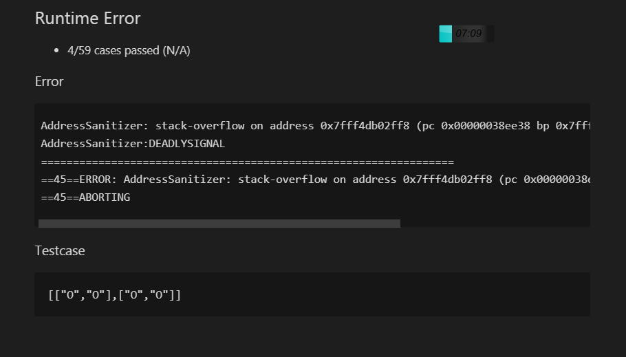

```
王阳明

志不立，天下无可成之事。虽百工技艺，未有不本于志者。今学者旷废隳惰，玩岁愒时，而百无所成，皆由于志之未立耳。故立志而圣，则圣矣；立志而贤，则贤矣；志不立，如无舵之舟，无衔之马，漂荡奔逸，终亦何所底乎？

志向不能立定，天下便没有可做得成功的事情。
虽然各种工匠有技能才艺的人，没有不以立志为根本的。

现在的读书人，旷废学业，堕落懒散，贪玩而荒费时日，因此百事无成，这都是由于志向未能立定罢了。

所以立志做圣人，就可以成为圣人了；

立志做贤人，就可成为贤人了。

志向没有立定，就好象没有舵木的船，没有衔环的马，随水漂流，任意奔逃，最后又到什幺地方为止呢？ 
```


###  一、题目描述

> 完成比完美更重要，自己动手写一些看

~~~
 [130] 被围绕的区域

 给定一个二维的矩阵，包含 'X' 和 'O'（字母 O）。

 找到所有被 'X' 围绕的区域，并将这些区域里所有的 'O' 用 'X' 填充。
~~~

 [130] 被围绕的区域

 给定一个二维的矩阵，包含 'X' 和 'O'（字母 O）。

 找到所有被 'X' 围绕的区域，并将这些区域里所有的 'O' 用 'X' 填充。


思考 60秒 。。。


思考 60秒 。。


- 放轻松，虽然是c++实现，拒绝奇技淫巧，通俗易懂。

  ~~~c++
  class Solution {
  public:
      void solve(vector<vector<char>>& board)
      {
  
          int rows = board.size();
          if (0 == rows)
              return;
          int cols = board[0].size();
          // dfs遍历 遍历边界节点的连通性 标记为#
          for (int i = 0; i < rows; i++) {
              for (int j = 0; j < cols; j++) {
                  //直接无法找到找到所有被 'X' 围绕的区域,从外围'O'开始
                  if ((i == 0 || j == 0 || i == rows - 1 || j == cols - 1) && board[i][j] == 'O') {
                      dfs(board, i, j);
                  }
              }
          }
          //第二次遍历
          for (int i = 0; i < rows; i++) {
              for (int j = 0; j < cols; j++) {
  
                  if (board[i][j] == 'O') {
                      board[i][j] = 'X';
                  }
                  if (board[i][j] == '#') {
                      board[i][j] = 'O';
                  }
              }
          }
      }
  
      void dfs(vector<vector<char>>& board, int i, int j)
      {
  
          // * X X X X
          // * X O O X
          // * X X O X
          // * X X O X
          //递归结束条件
          // if (i < 0 || j < 0 || i >= board.size() || j >= board[0].size() || board[i][j] == 'X') {
          //# --> <--- #
          if (i < 0 || j < 0 || i >= board.size() || j >= board[0].size() || board[i][j] == 'X' || board[i][j] == '#') {
              return;
          }
          //业务逻辑
          board[i][j] = '#'; //被包围的 和没有被包围的区分
          //递归逻辑
          dfs(board, i + 1, j);
          dfs(board, i - 1, j);
          dfs(board, i, j + 1);
          dfs(board, i, j - 1);
      }
  };
  ~~~

  

- golang 

~~~go
func solve(board [][]byte) {
	if board == nil || len(board) == 0 {
		return
	}
	// 先搜索并标记
	for i := 0; i < len(board); i++ {
		for j := 0; j < len(board[0]); j++ {
		    // 从边缘开始搜索, 判断是否在边上，只从边上开始，如果边上都是X，那么里面的所有O都换成X就行
		    // 如果边上有，那么之后就会被替换成#暂存，之后会被恢复成O，意味着不换成X
			isEdge := i == 0 || j == 0 || i == len(board)-1 || j == len(board[0])-1
			if isEdge && board[i][j] == 'O' {
				dfs(board, i, j)
			}
		}
	}
	// 再替换，这里的O都应该是被包围的
	// # 是和边界联通的，即不被包围的
	for i := 0; i < len(board); i++ {
	    for j := 0; j < len(board[0]); j++ {
	        if board[i][j] == 'O' {
	            board[i][j] = 'X'
            }
	        if board[i][j] == '#' {
	            board[i][j] = 'O'
            }
        }
    }
}
//go语言中非空切片是引用类型
func dfs(board [][]byte, i, j int) {
	// 边界判断
	// board[i][j] == '#': 说明已经搜索过
    //
	if i < 0 || j < 0 || i >= len(board) || j >= len(board[0]) || board[i][j] == 'X' || board[i][j] == '#' {
		return
	}

	// 和边界联通的O，先替换成#， 后续换回O
	board[i][j] = '#'

    //递归逻辑
	dfs(board, i+1, j)
	dfs(board, i-1, j)
	dfs(board, i, j+1)
	dfs(board, i, j-1)
}
~~~


### 二、测试用例

> 检查 题目是否看明白，理解有没有偏差

- 递归出现栈溢出错误

  这个bug，很经典



 

- 数组和指针 需要判断范围是否合法，在使用


这个题目试着这里开始入手

算法五个重要的特征：

- 输入项，输出项（题目已经给了）

- 可行性（复杂问题转化成熟悉子问题）

- 有穷性（在算法描述体现）

- 确切性（在算法描述体现）


### 三、解题思路


> 检查 思路是否清晰合理，不是靠道听途说, 别人说这样好就好，

#### 最迷惑地方

1. 按照标准dfs遍历，通过 0,扩展四周 ，如果 x 返回false 如果 0 0 这形成相互依赖，程序死循环了，无法判断是否围绕了。
2. 可能有一个做法能解决这个问题，但是我现在根本想不起来。我从周围连通性判断
3. 为什么不能直接 通过 一个点，判断四周是否 x？ ---因为00 这个情况无法判断，无法判断整体情况。和tree类似，无法判断全局
4. 被围绕的区间不会存在于边界上，已经改成答案了，这就是结果？还有连同的点呢
5. 如果两个元素在水平或垂直方向相邻，则称它们是“相连”的。


#### 熟悉的子问题

1. 给我一个二维数组，我只会i, j 从 0开始遍历

2. 从边界开始向内部扩散的

   

#### 步骤描述

- 字母 `X`；
- 被字母 `X` 包围的字母 `O`；
- 没有被字母 `X` 包围的字母 `O` (边界)


1. 第一次 遍历二维数组，对周边元素 采取 dfs 标记第三个情况 为#，

2. 第二次遍历维数组，#还原0，

    被字母 `X` 包围的字母 `O` 标记 x
    
3. dfs 过程：

    标记当前节点不访问 #，

    递归遍历，如果遇到该节点，类似回溯用栈控制。已经处理完毕。

####  复杂度分析

- 刷题时候，关闭参考答案 不然你不相信你分析，总是看答案
- 


###  四 、 举一反三


[【每日一题】：LeetCode 329. Longest Increasing Path in a Matrix #5](https://github.com/wangcy6/leetcode/issues/5)


> 分享最实用的经验 ， 希望每一位来访的朋友都能有所收获！
https://github.com/wangcy6/leetcode
> 如果有疑问请联系我，一起探讨，进步。