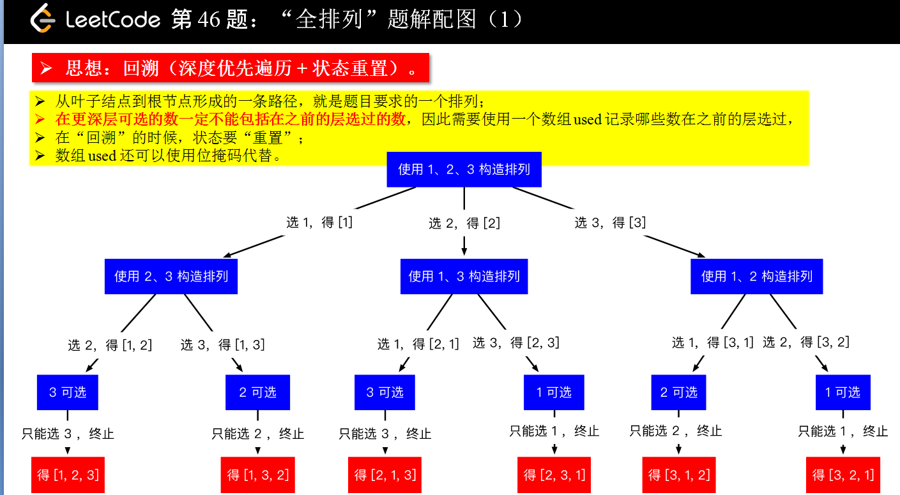
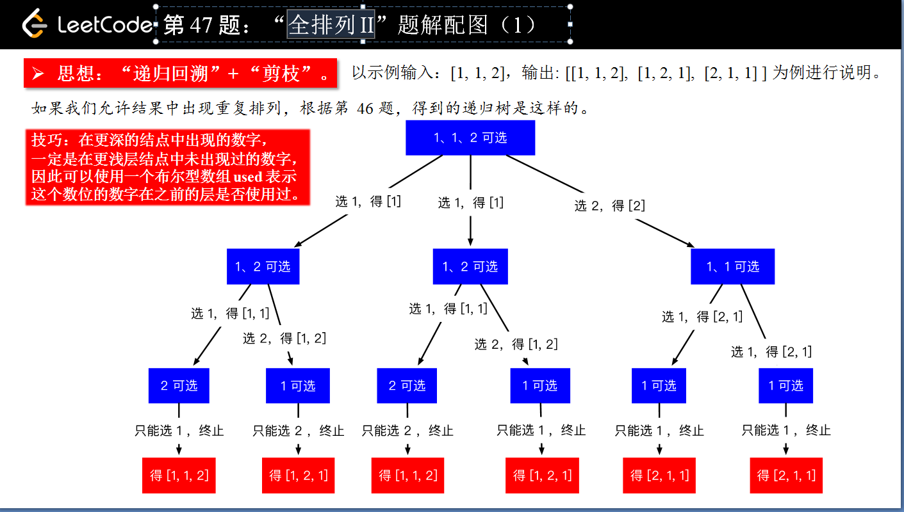
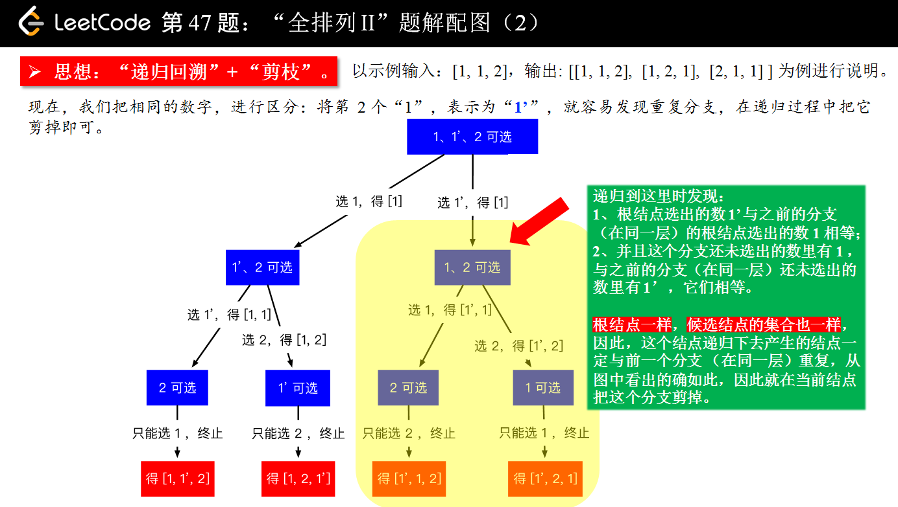
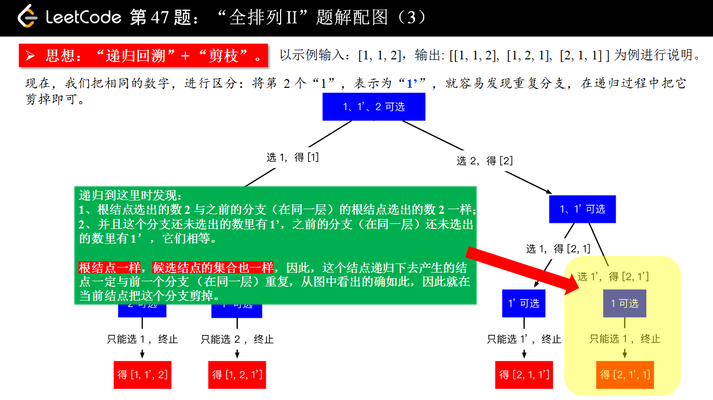
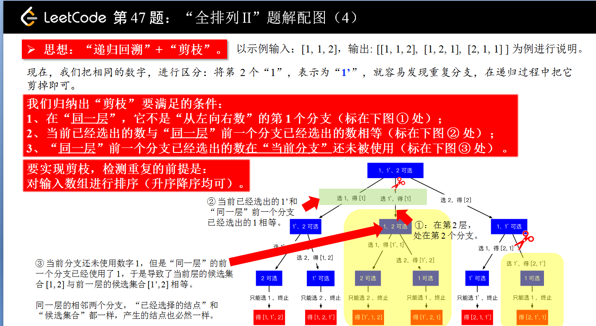
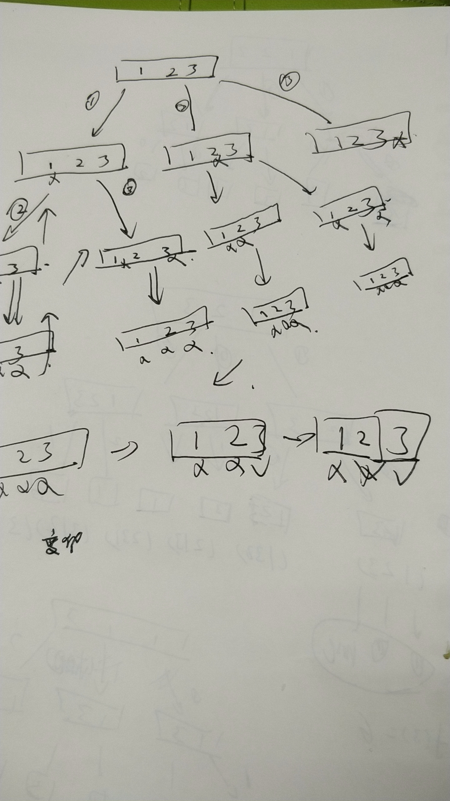

## 题目信息

> - 链接：[47. 全排列 II](https://leetcode-cn.com/problems/permutations-ii/)
> - 来源：LeetCode
> - 难度：Hard

### 一、描述

给定一个可包含重复数字的序列，返回所有不重复的全排列。

### 二、测试 

~~~scala
示例:

输入: [1,1,2]
输出:
[
  [1,1,2],
  [1,2,1],
  [2,1,1]
]
~~~

### 三、想法

> 该思路来源liweiwei1419 （侵删）

- 输入 [1 2 3] 输出全排列 6个

- 输入[1,1,2] 输出全排列 3个

### 四、重点

 [回溯 + 剪枝（Python、Java、C++）](https://leetcode-cn.com/problems/permutations-ii/solution/hui-su-suan-fa-python-dai-ma-java-dai-ma-by-liwe-2/) 

纠正：

代码执行顺序是什么，马上多线程并发执行。这个观点

影响了现在刷题 论动态规划，还是回溯，递归，你还以为是并发执行，乱顺根本无法控制。

今天才意识到 都是顺序执行的。

简单说你利用函数栈，什么不管，如何出入栈不用管

复杂点自己使用栈，**自己重新设置出入栈的状态** 

这回溯的真实含义。 无数个路径，寻找到其中的一个。

### 五、code

- 错误答案

### 六、  进阶 

> 分享最实用的经验 ， 希望每一位来访的朋友都能有所收获！ 

