## 题目信息

> - 链接：[51. N皇后](https://leetcode-cn.com/problems/n-queens/)
> - 来源：LeetCode
> - 难度：Hard

### 一、描述 n-queens

*n* 皇后问题研究的是如何将 *n* 个皇后放置在 *n*×*n* 的棋盘上，并且使皇后彼此之间不能相互攻击。


上图为 8 皇后问题的一种解法。


 八皇后问题是在一个 8*8 的棋盘上放置皇后，

要求其放置后满足同一行，同一列，同一对角线上没有重复的皇后出现。试问有多少种摆盘方式 


### 二、测试 

```shell
输入: 4
输出: [
 [".Q..",  // 解法 1
  "...Q",
  "Q...",
  "..Q."],

 ["..Q.",  // 解法 2
  "Q...",
  "...Q",
  ".Q.."]
]
解释: 4 皇后问题存在两个不同的解法。
```

### 三、想法

 主要参考 https://leetcode-cn.com/problems/n-queens/solution/nhuang-hou-by-leetcode/ 


#### 1 请问用最笨的循环变量怎么做，能完整描述过程吗，能画出过程吗？

> 画外音：不考虑最优解


为了简化问题，N=4 

> 最后只有2个正确答案。

​	


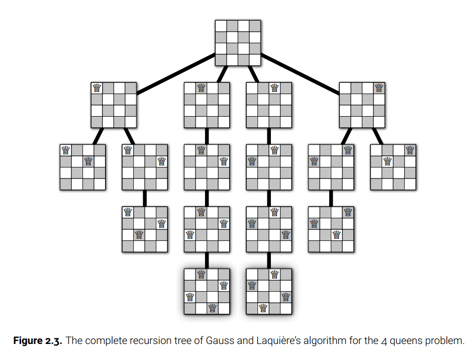

 

#### 2  你看明白了 如何判断一个坐标能不能放置皇后   （ 观察法） 

同一行 ：只有一个 （选择1 , ）

同一个列 ： 只有一个（剩余  2 3 4选择 ，看看有没有选择）

2个对角线：只有一个


判断（1，0） 能不放置 ，依赖 （0，0） 有没有皇后  同一列上

判断(1,1) 能不能放置，判断(0,0) 有没有记录 

判断(3,3) 能不能放置，依赖(0,0) (1,1)(2,2) 有没有元素

判断（3，0） 能不能放置，依赖(2,1) (1,2)(0,4) 有没有元素


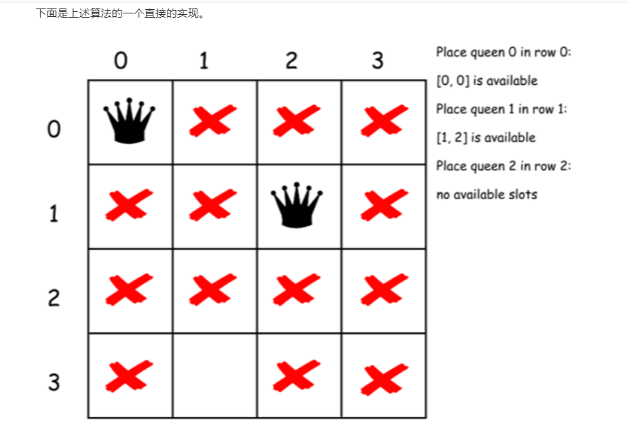


#### 3 你已经看明白了可以在棋盘上放置皇后如下（无脑选择呀）

以下假定给棋盘的每一行从左到右标记为 11、22、33、44：


 

 

#### 4 你已经明白了 过程如下

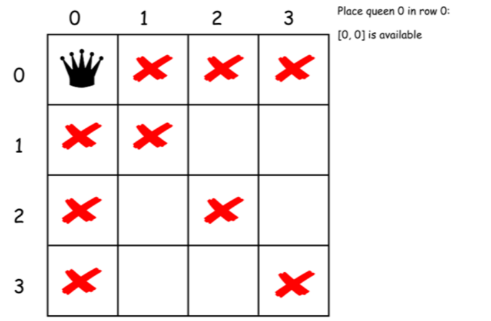


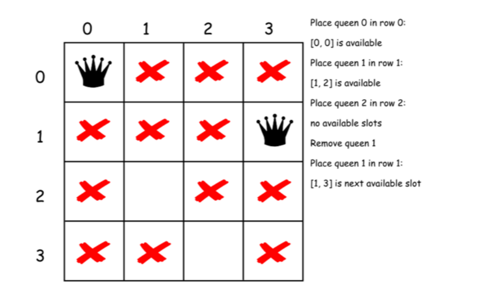

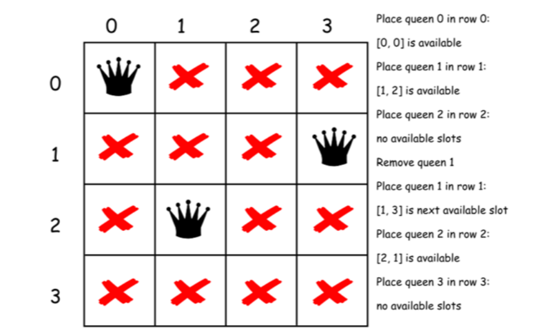

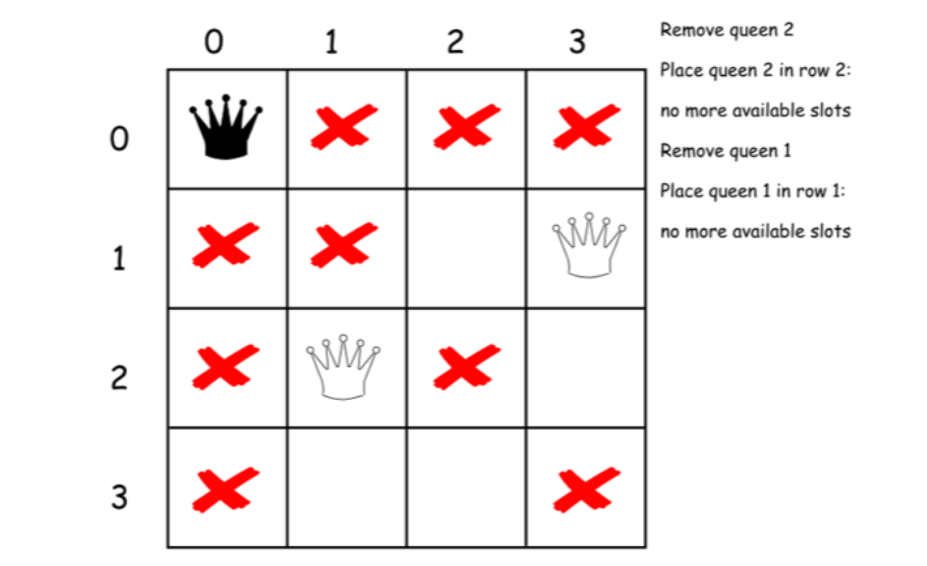

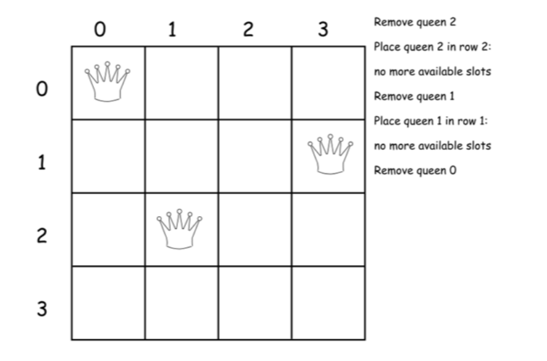

- 第二次开始

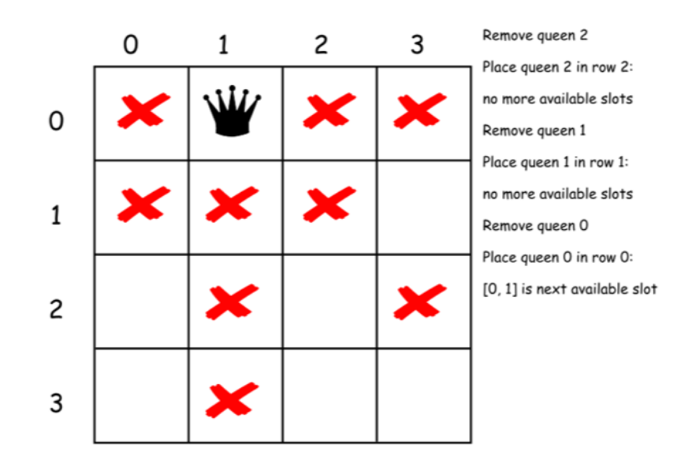

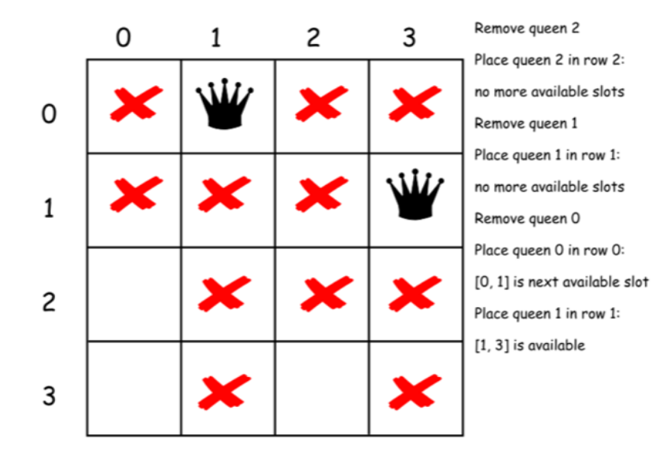

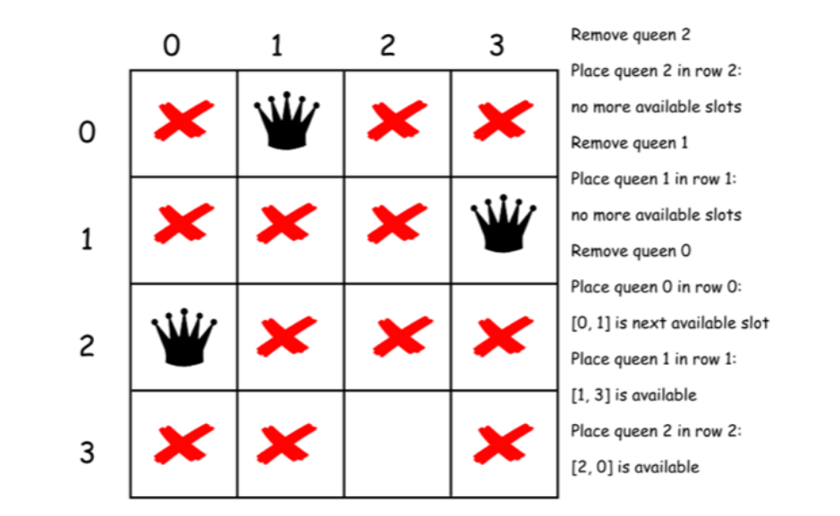

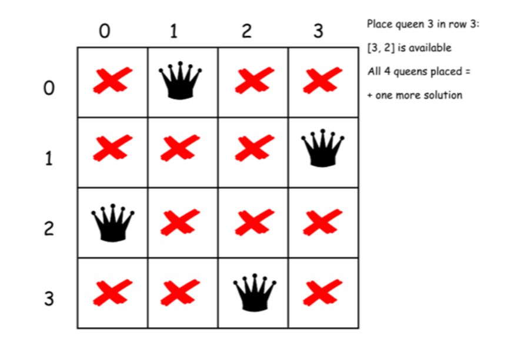

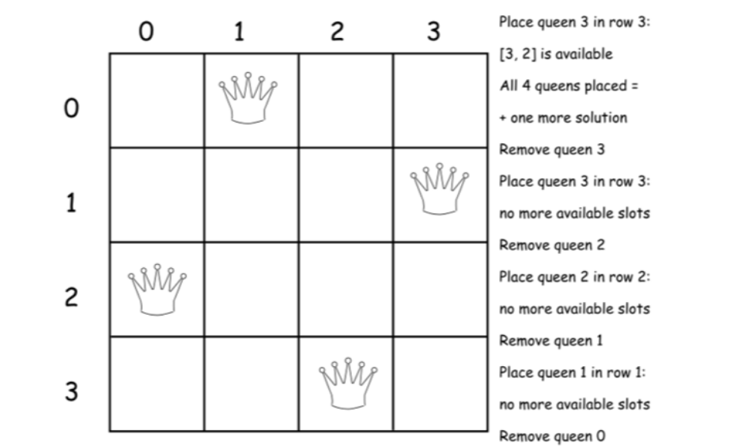


- 第三次开始

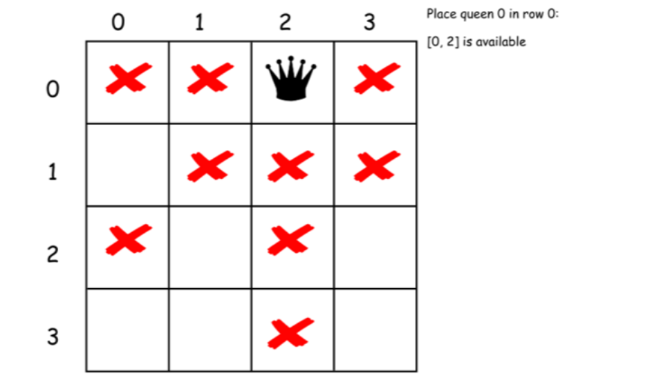

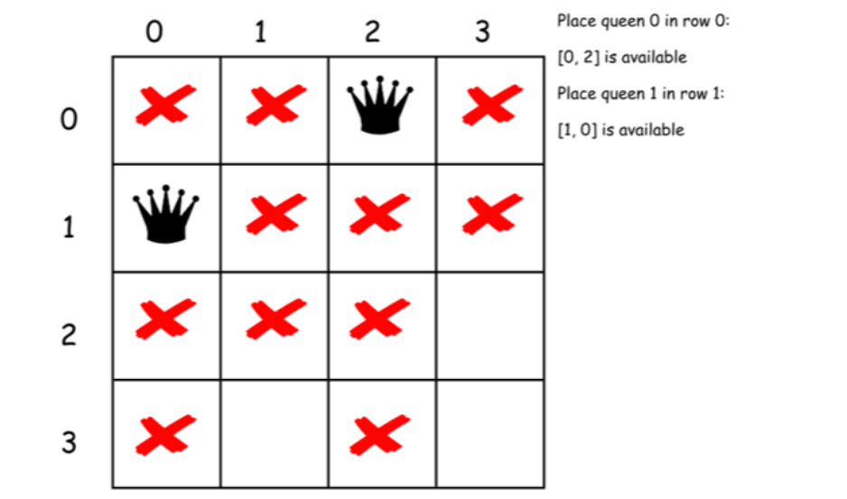

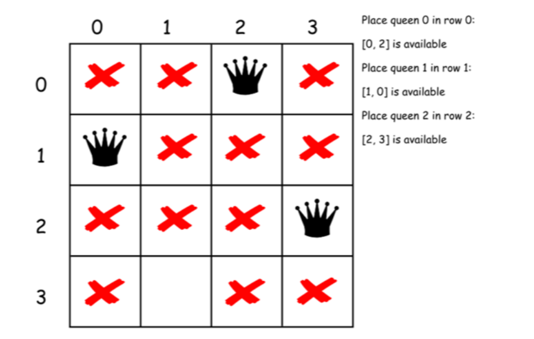

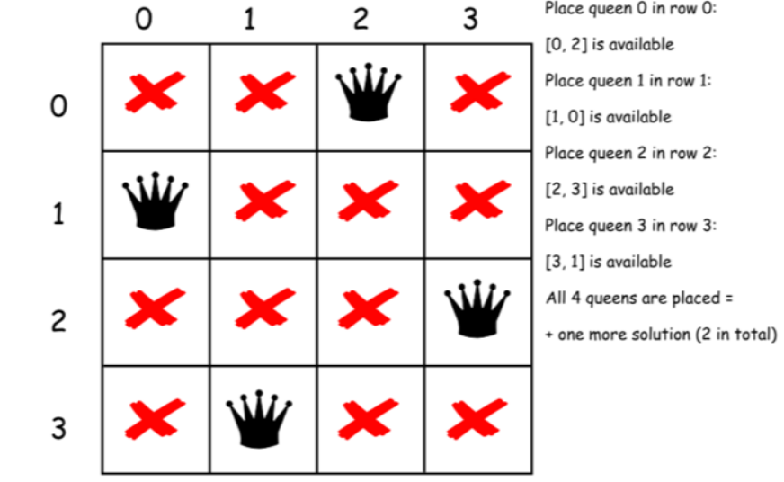

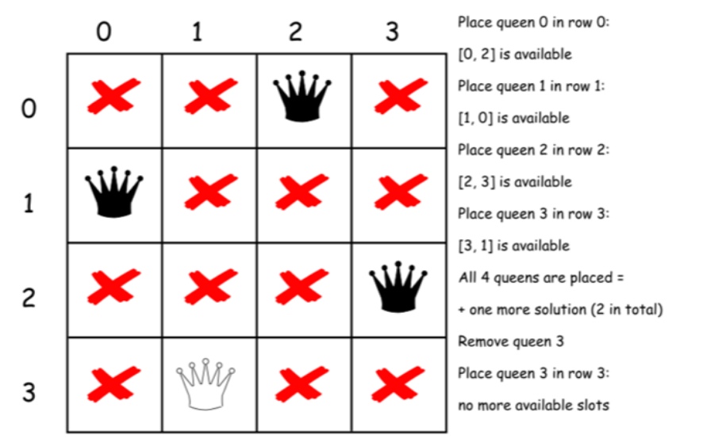

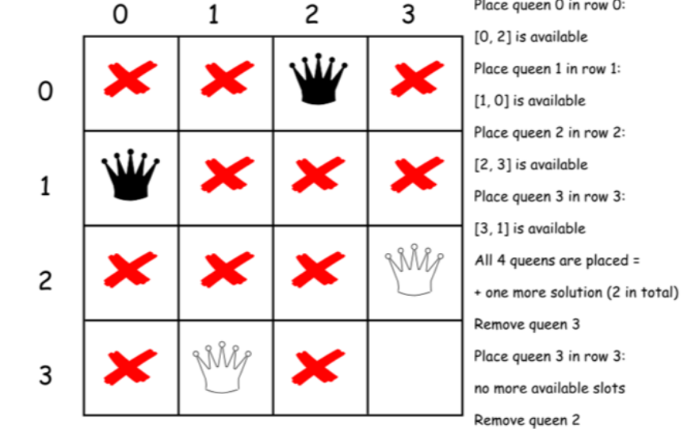

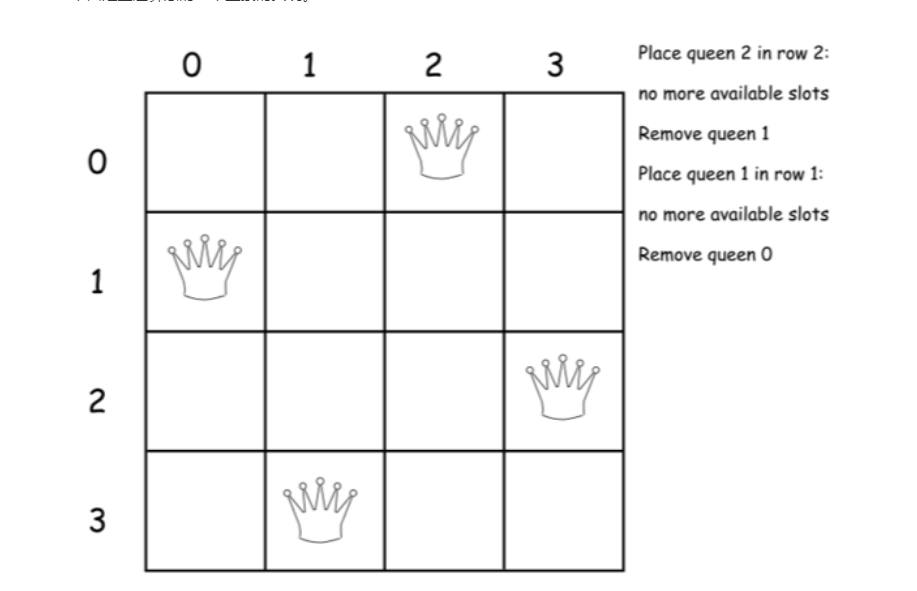

### 四、重点


 [约束编程+回溯法](https://leetcode-cn.com/problems/n-queens/solution/c-yue-shu-bian-cheng-hui-su-fa-by-zleopard/) 

> 回溯发就是暴力破解方法，每次选择n个情况，一共n次选择， 指数级别

> 如何记录历史选择情况，和利用约束条件减少递归次数是关键


约束条件：就是同一行，同一列 ，对角线上

历史选择情况：used记录当前路径的选择情况。 上次权排列用数组，这次也可以，这次二维代替。


### 五、code


- c++ 我只看懂来这一个

  ~~~c++
  class Solution {
  public:
    std::vector<std::vector<std::string>> solveNQueens(int n) {
      std::vector<std::vector<std::string>> res;
      std::vector<std::string> nQueens(n, std::string(n, '.')); //记录历史选择过程
      solveNQueens(res, nQueens, 0, n);
      return res;
    }
  
  private:
    void solveNQueens(std::vector<std::vector<std::string>> &res,
                      std::vector<std::string> &nQueens, int row, int &n) {
      if (row == n) {
        res.push_back(nQueens);
        return;
      }
      for (int col = 0; col != n; ++col)
        if (isValid(nQueens, row, col, n)) {
          nQueens[row][col] = 'Q';
          solveNQueens(res, nQueens, row + 1, n);
          nQueens[row][col] = '.';
        }
    }
    bool isValid(std::vector<std::string> &nQueens, int row, int col, int &n) {
      // check if the column had a queen before.
      for (int i = 0; i != row; ++i)
        if (nQueens[i][col] == 'Q')
          return false;
      // check if the 45° diagonal had a queen before.
      for (int i = row - 1, j = col - 1; i >= 0 && j >= 0; --i, --j)
        if (nQueens[i][j] == 'Q')
          return false;
      // check if the 135° diagonal had a queen before.
      for (int i = row - 1, j = col + 1; i >= 0 && j < n; --i, ++j)
        if (nQueens[i][j] == 'Q')
          return false;
      return true;
    }
  };
  ~~~

  


### 六、  进阶 


> 分享最实用的经验 ， 希望每一位来访的朋友都能有所收获！ 

### ref

-  https://github.com/mission-peace/interview/blob/master/src/com/interview/recursion/NQueenProblem.java 

-  https://www.youtube.com/watch?v=xouin83ebxE 

  