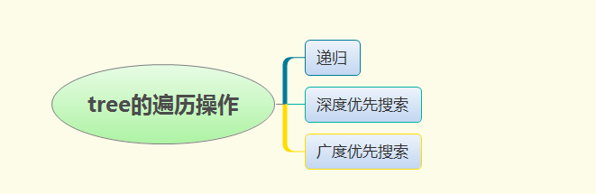
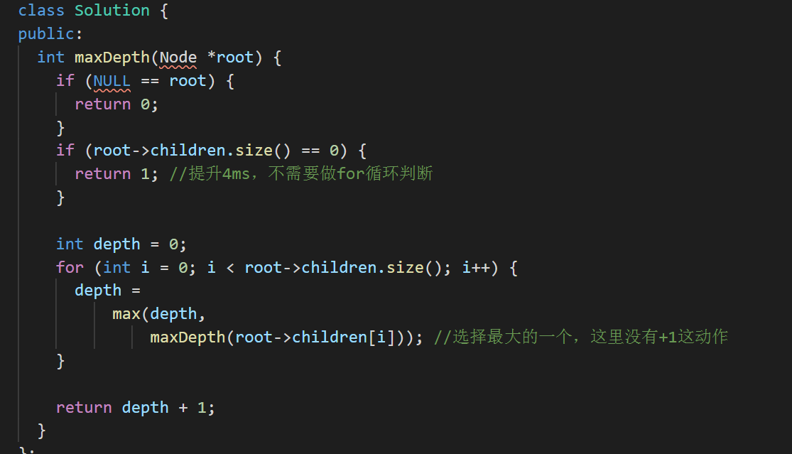
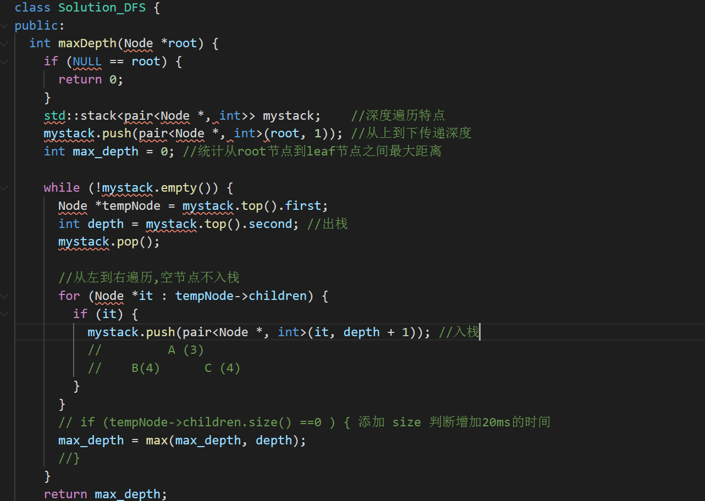

### 题目

给定一个 N 叉树，找到其最大深度。

最大深度是指从根节点到最远叶子节点的最长路径上的节点总数。

例如，给定一个 3叉树 :

 


我们应返回其最大深度，3。

```
说明:

树的深度不会超过 1000。
树的节点总不会超过 5000
```


### 想法


虽然这是一个easy级别题目，但是包含思想比较好，从2叉树 改成N叉树，考验以前是不是死记硬背，不会回融会贯通。

不管什么类似的Tree，一个基本操作就是遍历。

遍历方式



> 递归遍历，依赖最底层的反馈


如果是2个节点的 只需要一次max比较，如果是多个节点要重复多次，需要循环处理


> 非递归--深度优先搜索DFS


> 非递归--BFS（Broad First Search）


### 要点


如果实现非递归遍历方式，二叉树 如果是层次遍历 需要借助队列，如果是递归遍历需要借助栈。


### 复杂度


### 代码

- c++ 递归

  

- DFS

