## 题目信息

> - 链接：[LeetCode 493. Reverse Pairs](https://leetcode.com/problems/reverse-pairs/description/)
> - 来源：LeetCode
> - 难度：Hard

### 一、描述

在数组中的两个数字如果前面一个数字大于后面的数字，则这两个数字组成一个逆序对。

给你一个数组，求出这个数组中逆序对的总数。

逆序对概括：

如果a[i] > a[j] 且 i < j， a[i] 和 a[j] 构成一个逆序对。


### 二、测试 

~~~tiki wiki
样例1

输入: A = [2, 4, 1, 3, 5]
输出: 3
解释:
(2, 1), (4, 1), (4, 3) 是逆序对

样例2
输入: A = [1, 2, 3, 4]
输出: 0
解释:没有逆序对
https://www.lintcode.com/problem/reverse-pairs/description
~~~


### 三、想法

> 这个题目思路来源  https://leetcode-cn.com/problems/gas-station/solution/jia-you-zhan-by-leetcode/ 


> 对于加油站 `i` ，如果 `gas[i] - cost[i] < 0` ，则不可能从这个加油站出发，因为在前往 `i + 1` 的过程中，汽油就不够了 


 输入: 
gas  = [1,2,3,4,5]
cost = [3,4,5,1,2] 


> 如果 `sum(gas) < sum(cost)` ，那么不可能环行一圈，这种情况下答案是 `-1` 。

```
输入: 
gas  = [2,3,4]
cost = [3,4,3]

输出: -1

解释:
你不能从 0 号或 1 号加油站出发，因为没有足够的汽油可以让你行驶到下一个加油站。
我们从 2 号加油站出发，可以获得 4 升汽油。 此时油箱有 = 0 + 4 = 4 升汽油
开往 0 号加油站，此时油箱有 4 - 3 + 2 = 3 升汽油
开往 1 号加油站，此时油箱有 3 - 3 + 3 = 3 升汽油
你无法返回 2 号加油站，因为返程需要消耗 4 升汽油，但是你的油箱只有 3 升汽油。
因此，无论怎样，你都不可能绕环路行驶一周。
```

#### 完整演示

```
输入: 
gas  = [1,2,3,4,5]
cost = [3,4,5,1,2]
```

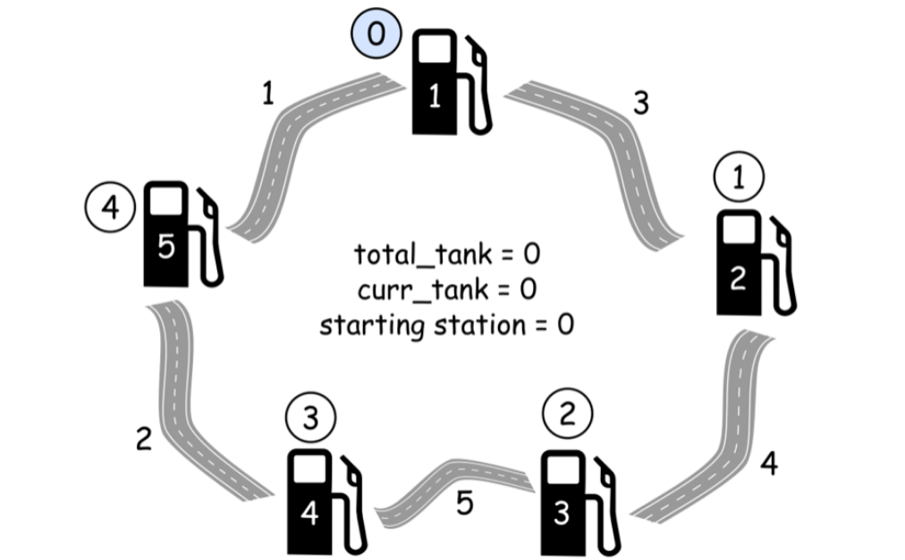

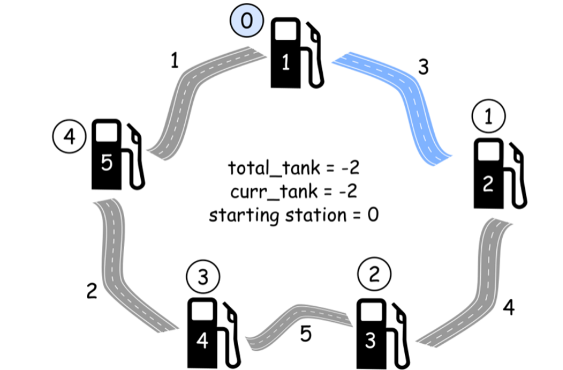

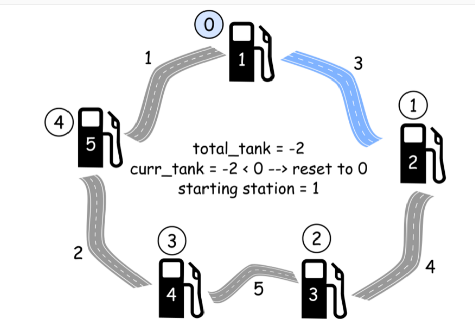


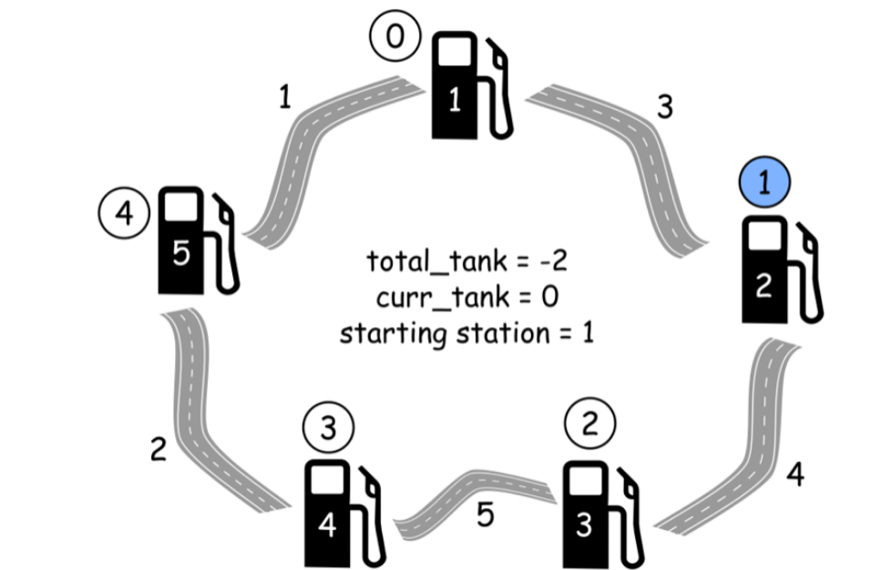

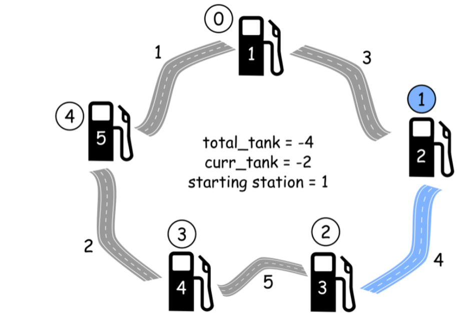

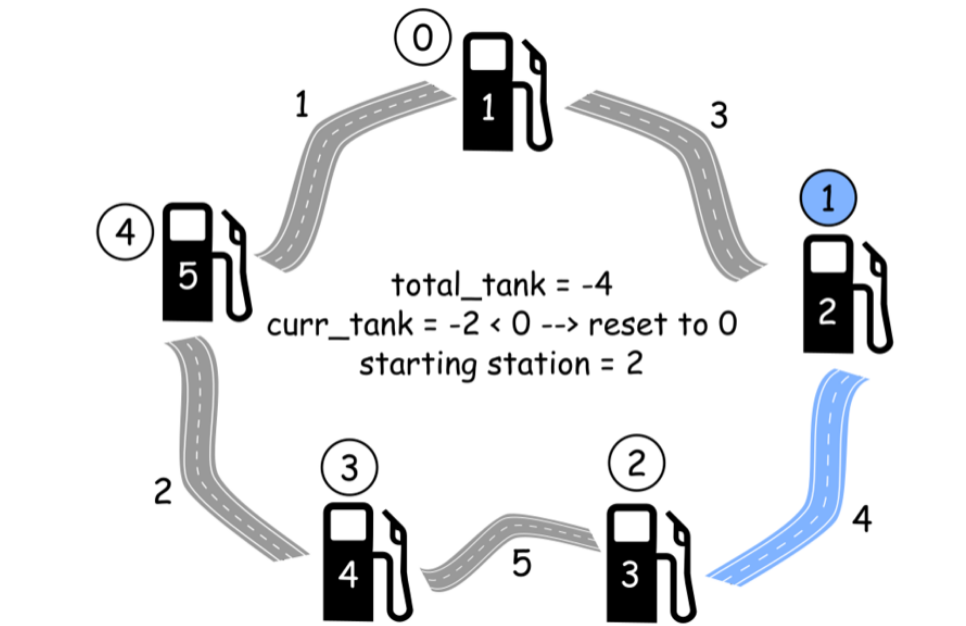

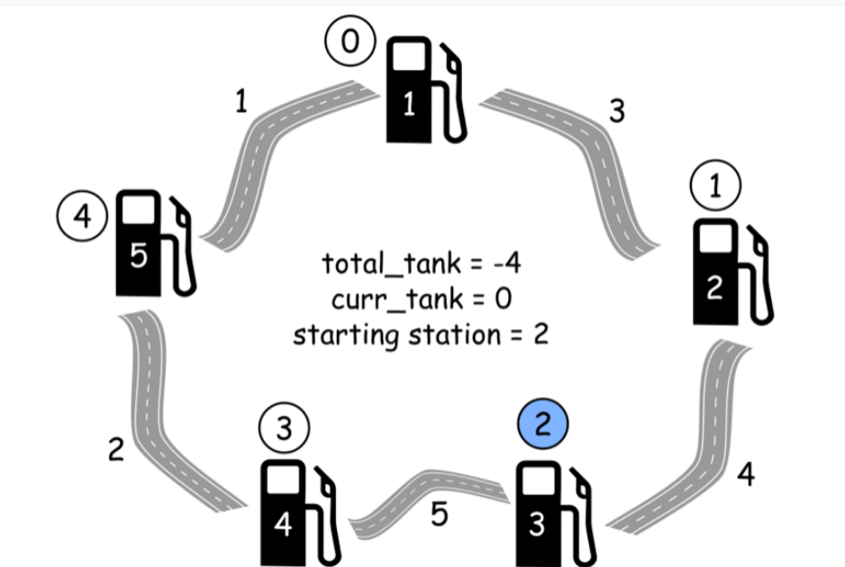

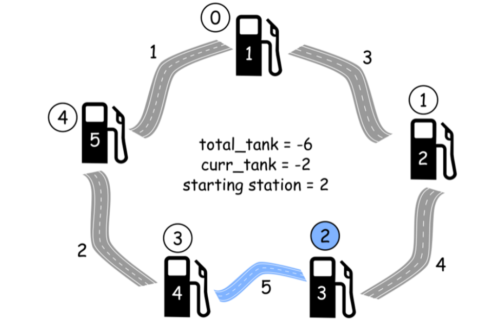

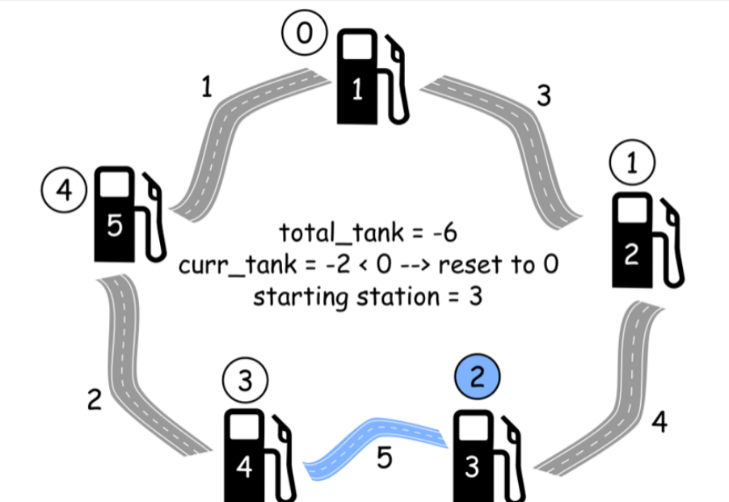

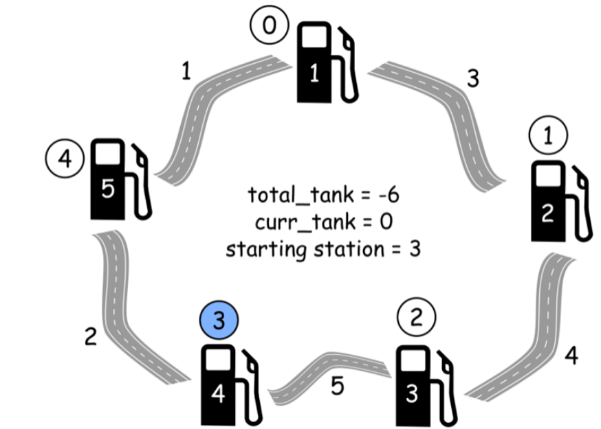

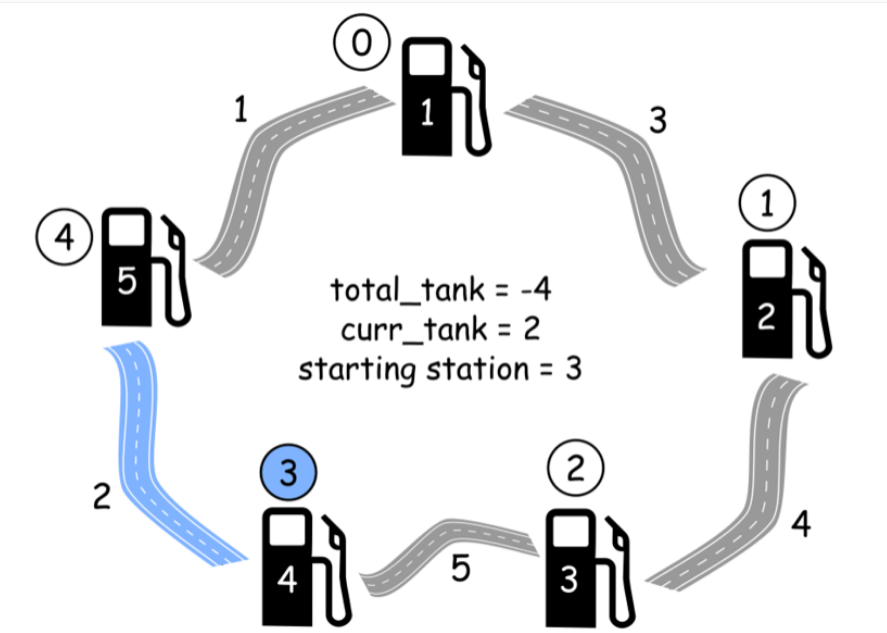

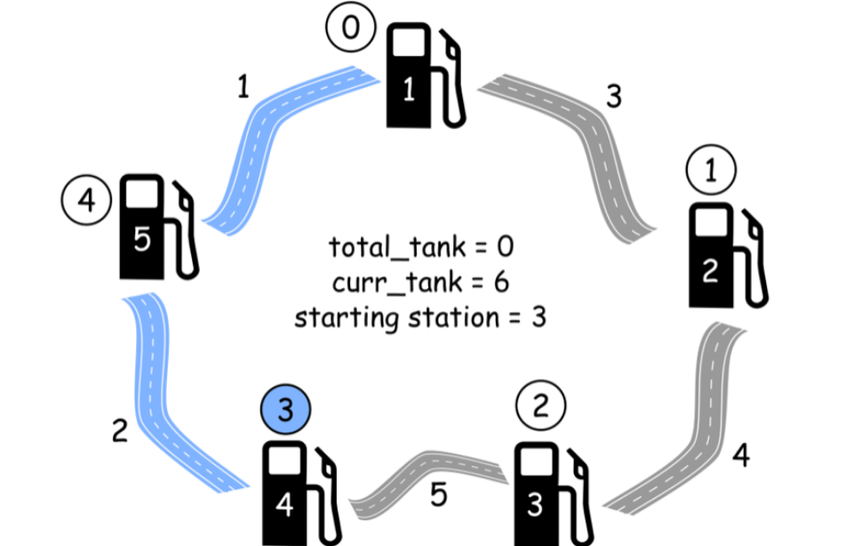

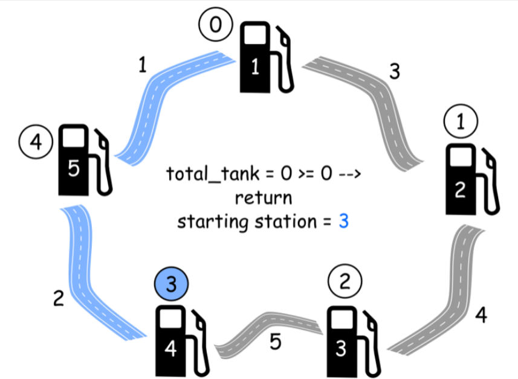


### 四、重点


复杂度分析

时间复杂度：O(N) ， 这是因为只有一个遍历了所有加油站一次的循环。

空间复杂度： O(1) ，因为此算法只使用了常数个变量。

作者：LeetCode
链接：https://leetcode-cn.com/problems/gas-station/solution/jia-you-zhan-by-leetcode/
来源：力扣（LeetCode）
著作权归作者所有。商业转载请联系作者获得授权，非商业转载请注明出处。


### 五、code


~~~c++
//c++
class Solution {
public:
  /**
   * @param A: an array
   * @return: total of reverse pairs
   * https://www.lintcode.com/problem/reverse-pairs/description
   * Given an array, return the number of reverse pairs in the array
   */
  long long reversePairs(vector<int> &A) {
    vector<int> temp(A.size(), 0); //归并排序，需要一个额外空间合并2个有序记录
    return mergeSort(A, 0, A.size() - 1, temp);
  }
  long long mergeSort(vector<int> &array, int start, int end,
                      vector<int> &temp) {
    if (start >= end) {
      return 0;
    }
    long long inversions = 0;
    int mid = start + (end - start) / 2;

    inversions += mergeSort(array, start, mid, temp); //找左半段的逆序对数目
    inversions += mergeSort(array, mid + 1, end, temp); ///找右半段的逆序对数目
    inversions += mergeFromBein(
        array, start, mid, end,
        temp); //在找完左右半段逆序对以后两段数组有序，然后找两段之间的逆序对。
    return inversions;
  }

  long long mergeFromBein(vector<int> &array, int start, int mid, int end,
                          vector<int> &temp) {

    // arry[start...mid]左半段长度
    // arry[mid+1...end]右半段长度
    int p1 = start;
    int p2 = mid + 1;
    int k = 0;
    long long sum = 0;
    while (p1 <= mid && p2 <= end) {
      if (array[p1] > array[p2]) { // p2 小
        sum += mid - p1 + 1;       //在这统计逆序对
        temp[k++] = array[p2++];
      } else {
        temp[k++] = array[p1++];
      }
    }

    // 把左边剩余的数移入数组
    while (p1 <= mid) {
      temp[k++] = array[p1++];
    }

    // 把右边边剩余的数移入数组
    while (p2 <= end) {
      temp[k++] = array[p2++];
    }

    // 把新数组中的数覆盖nums数组
    for (int k = 0; k < temp.size(); k++) {
      array[start + k] = temp[k];
    }
  }

  long long mergeFromEnd(vector<int> &array, int start, int mid, int end,
                         vector<int> &temp) {
    // arry[start...mid]左半段长度
    // arry[mid+1...end]右半段长度
    temp.clear();
    int p1 = mid;
    int p2 = end;
    int index = 0;
    long long count = 0;
    while (p1 >= start && p2 > mid) {

      if (array[p1] > array[p2]) {
        temp[index++] = array[p1--];
        count += p2 - mid; //在这统计逆序对
      } else {
        temp[index++] = array[p2--];
      }
    }
    // cout << "mergeArray " << count;
    while (p1 >= start) {
      temp[index++] = array[p1--];
    }

    while (p2 > mid) {
      temp[index++] = array[p2--];
    }

    //将临时数组中的元素写回到原数组当中去。
    for (int i = 0; i < index; i++)
      array[end - i] = temp[i];

    return count;
  }

  void printArray(vector<int> &array) {
    for (int i = 0; i < array.size(); i++)
      cout << array[i] << " ";
    cout << endl;
  }
};
~~~


### 六、  进阶 


剑指Offer面试题：28.连续子数组的最大和


> 分享最实用的经验 ， 希望每一位来访的朋友都能有所收获！ 

如果有疑问联系我  https://github.com/wangcy6/leetcode 


