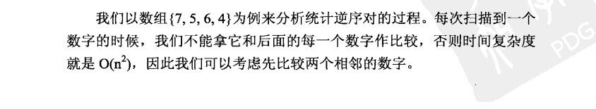

## 题目信息

> - 链接：[LeetCode 493. Reverse Pairs](https://leetcode.com/problems/reverse-pairs/description/)
> - 来源：LeetCode
> - 难度：Hard

### 一、描述

在数组中的两个数字如果前面一个数字大于后面的数字，则这两个数字组成一个逆序对。

给你一个数组，求出这个数组中逆序对的总数。

逆序对概括：

如果a[i] > a[j] 且 i < j， a[i] 和 a[j] 构成一个逆序对。


### 二、测试 

~~~tiki wiki
样例1

输入: A = [2, 4, 1, 3, 5]
输出: 3
解释:
(2, 1), (4, 1), (4, 3) 是逆序对

样例2
输入: A = [1, 2, 3, 4]
输出: 0
解释:没有逆序对
https://www.lintcode.com/problem/reverse-pairs/description
~~~


### 三、想法





~~~

例如7,5,4,6可以划分为两段7,5  和   4,6两个子数组
(长度为1的2个数组如何求逆序，然后合并)
1. 在7,5中求出逆序对，因为7大于5所以 有1对  total=1
2. 在6,4中求出逆序对，因为6大于4所以逆序对再加1，为2,total=2
3. 对7,5和6,4进行排序，结果为5,7,和4,6

(长度大于1 的2个数组如何求逆序，然后合并)

4. 设置两个指针分别指向两个子数组中的最大值，p1指向7，p2指向6

5. 比较p1和p2指向的值，如果P1大于p2 7>6，因为p2指向的是最大值，所以第二个子数组中有几个元素就有几对逆序对(当前有两个元素，逆序对加2,2+2=4)， total=4,
比较完之后将p1指向的值放入辅助数组里，辅助数组里现在有一个数字7，然后将p1向前移动一位指向5

6. 再次判断p1和p2指向的值，p1小于p2 5<6，因为p1指向的是第一个子数组中最大值，所以子数组中没有能和当前p2指向的6构成逆序对的数，将p2指向的值放入辅助数组，并向前移动一位指向4，此时辅助数组内为6,7


7. 继续判断p1(指向5)和p2(指向4)，5>4,第二个子数组中只有一个数字，逆序对加1，4+1=5，为5对，total=5
 然后将5放入辅助数组，第一个子数组遍历完毕，只剩下第二个子数组，当前只有一个4，将4也放入辅助数组，函数结束。
 
 辅助数组此时为4,5,6,7.逆序对为5
 
2个有序数组的合并逻辑

~~~


细心你发现 这个合并和平时理解不一样，一般都是从到大合并就不能统计逆序对了吗？

也可以


```c++
4. 设置两个指针分别指向两个子数组中的最小值，p1指向5，p2指向4

5. 比较p1和p2指向的值，如果P1大于p2 (5>4)，因为p1指向的是最小值，所以第二个子数组中有几个元素就有几对逆序对 5和7  （5>4, 7>4 ）
   比较完之后将(p1)指向的值放入辅助数组里，辅助数组里现在有一个数字4，然后将p2向前移动一位指向
6. 再次判断p1和p2指向的值，p1小于p2  5<6,这次移动是5，没有逆序
```


### 四、重点

如何想归排序，并且转换到归并排序上是难点


统计逆序对，整个排序过程没有任何影响。这个一般和难想到，尤其是排序

尤其是统计逆序对，建立有序基础上。

- 如果最大值都小于我，肯定前面都小于我（正向）
- 如果最小值都大于我，肯定后面的都大于我（逆向）


优化：

归并排序 采用分治递归方式。

在链表合并过程中需要依赖额外空间。建立公共变量性能提高5ms


### 五、code


~~~c++
//c++
class Solution {
public:
  /**
   * @param A: an array
   * @return: total of reverse pairs
   * https://www.lintcode.com/problem/reverse-pairs/description
   * Given an array, return the number of reverse pairs in the array
   */
  long long reversePairs(vector<int> &A) {
    vector<int> temp(A.size(), 0); //归并排序，需要一个额外空间合并2个有序记录
    return mergeSort(A, 0, A.size() - 1, temp);
  }
  long long mergeSort(vector<int> &array, int start, int end,
                      vector<int> &temp) {
    if (start >= end) {
      return 0;
    }
    long long inversions = 0;
    int mid = start + (end - start) / 2;

    inversions += mergeSort(array, start, mid, temp); //找左半段的逆序对数目
    inversions += mergeSort(array, mid + 1, end, temp); ///找右半段的逆序对数目
    inversions += mergeFromBein(
        array, start, mid, end,
        temp); //在找完左右半段逆序对以后两段数组有序，然后找两段之间的逆序对。
    return inversions;
  }

  long long mergeFromBein(vector<int> &array, int start, int mid, int end,
                          vector<int> &temp) {

    // arry[start...mid]左半段长度
    // arry[mid+1...end]右半段长度
    int p1 = start;
    int p2 = mid + 1;
    int k = 0;
    long long sum = 0;
    while (p1 <= mid && p2 <= end) {
      if (array[p1] > array[p2]) { // p2 小
        sum += mid - p1 + 1;       //在这统计逆序对
        temp[k++] = array[p2++];
      } else {
        temp[k++] = array[p1++];
      }
    }

    // 把左边剩余的数移入数组
    while (p1 <= mid) {
      temp[k++] = array[p1++];
    }

    // 把右边边剩余的数移入数组
    while (p2 <= end) {
      temp[k++] = array[p2++];
    }

    // 把新数组中的数覆盖nums数组
    for (int k = 0; k < temp.size(); k++) {
      array[start + k] = temp[k];
    }
  }

  long long mergeFromEnd(vector<int> &array, int start, int mid, int end,
                         vector<int> &temp) {
    // arry[start...mid]左半段长度
    // arry[mid+1...end]右半段长度
    temp.clear();
    int p1 = mid;
    int p2 = end;
    int index = 0;
    long long count = 0;
    while (p1 >= start && p2 > mid) {

      if (array[p1] > array[p2]) {
        temp[index++] = array[p1--];
        count += p2 - mid; //在这统计逆序对
      } else {
        temp[index++] = array[p2--];
      }
    }
    // cout << "mergeArray " << count;
    while (p1 >= start) {
      temp[index++] = array[p1--];
    }

    while (p2 > mid) {
      temp[index++] = array[p2--];
    }

    //将临时数组中的元素写回到原数组当中去。
    for (int i = 0; i < index; i++)
      array[end - i] = temp[i];

    return count;
  }

  void printArray(vector<int> &array) {
    for (int i = 0; i < array.size(); i++)
      cout << array[i] << " ";
    cout << endl;
  }
};
~~~


### 六、  进阶 


#### [493. 翻转对](https://leetcode-cn.com/problems/reverse-pairs/)

给定一个数组 nums ，如果 i < j 且 nums[i] > 2*nums[j] 我们就将 (i, j) 称作一个重要翻转对。

你需要返回给定数组中的重要翻转对的数量

> 比较规则a>b 变成a>2*b ,其他方式没有发生变化，但是这样就无法合并了，

> 统计翻转对和合并 这 个逻辑是分开的。


> 分享最实用的经验 ， 希望每一位来访的朋友都能有所收获！ 

### ref

- https://www.cnblogs.com/chengxiao/p/6194356.html 

  