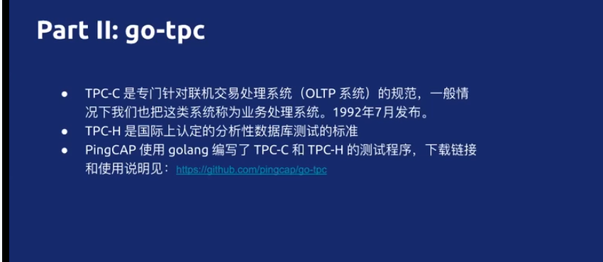
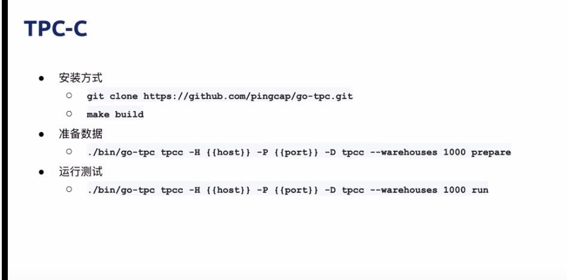

### 题目

~~~shell
分值：300

题目描述：

使用 sysbench、go-ycsb 和 go-tpc 分别对
 TiDB 进行测试并且产出测试报告。

测试报告需要包括以下内容：
* 部署环境的机器配置(CPU、内存、磁盘规格型号)，拓扑结构(TiDB、TiKV 各部署于哪些节点)
* 调整过后的 TiDB 和 TiKV 配置
* 测试输出结果
* 关键指标的监控截图
	    * TiDB Query Summary 中的 qps 与 duration
	    * TiKV Details 面板中 Cluster 中各 server 的 CPU 以及 QPS 指标
	    * TiKV Details 面板中 grpc 的 qps 以及 duration

输出：写出你对该配置与拓扑环境和 workload 下 TiDB 集群负载的分析，
提出你认为的 TiDB 的性能的瓶颈所在(能提出大致在哪个模块即 可
~~~

### 机器配置

| 软件   | 版本           | 备注      |
| ------ | -------------- | --------- |
| Ubuntu | 18.04          | 虚拟机1个 |
| cpu    | Virtual CPU  3 |           |
| 内存   | 2G             |           |
|        |                |           |

面板：http://www.mytidb.com:2379/dashboard/#/overview

##   测试方案1 --了解工具，观察规律

> tiup cluster deploy tidb-test v4.0.0 ./topology1.yaml --user root -p

| 拓扑结构 | 个数 | 关键参数 |
| -------- | ---- | -------- |
| Tidb     | 1    |          |
| pd       | 1    | 同一个   |
| TiKV     | 1    | 同一个   |

####  sysbench

- 准备数据：

  sysbench --config-file=./sysbench-thread-1.cfg oltp_point_select --tables=16 --table-size=10000 prepare

- 测试结果

    sysbench --config-file=./sysbench-thread-1.cfg oltp_point_select --tables=16 --table-size=10000 run

| type         | thread | tps     | qps     | min latency | avg latency | 95th latency | max latency |
| ------------ | ------ | ------- | ------- | ----------- | ----------- | ------------ | ----------- |
| point_select | 1      | 1008.1  | 1008.1  | 0.42        | 0.99        | 1.7          | 44.97       |
| point_select | 3      | 2741.31 | 2741.31 | 0.37        | 1.09        | 2.26         | 39.55       |
| point_select | 8      | 3225.38 | 3225.38 | 0.37        | 2.48        | 6.91         | 62.25       |
| point_select | 16     | 3822.22 | 3822.22 | 0.4         | 4.18        | 17.63        | 87.57       |
| point_select | 32     | 4612.22 | 4612.22 | 0.4         | 6.93        | 17.63        | 87.64       |
| point_select | 64     | 4455.49 | 4455.49 | 0.48        | 14.35       | 34.95        | 132.55      |
| point_select | 128    | 5020.49 | 5020.49 | 0.48        | 25.45       | 56.84        | 182.4       |
| point_select | 256    | 5496.24 | 5496.24 | 0.53        | 46.47       | 99.33        | 306.11      |

> 第一步:观察规律

- 随着线程数量增加，虽然Qps增加，但是线程增加256倍，qps增加5倍，并且平均延迟逐渐增加。推测上下文切换造成的。

~~~shell
perf top
Samples: 1M of event 'cpu-clock', Event count (approx.): 42484621630                                                                                          
Overhead  Shared Object                 Symbol                                                                                                                
   3.80%  [kernel]                      [k] finish_task_switch                                                                                                
   3.58%  [kernel]                      [k] _raw_spin_unlock_irqrestore                                                                                       
   2.65%  tidb-server                   [.] runtime.scanobject                                                                                                
   2.44%  tidb-server                   [.] runtime.mallocgc                                                                                                  
   1.57%  tidb-server                   [.] runtime.findObject                                                                                                
   1.50%  tidb-server                   [.] runtime.heapBitsSetType                                                                                           
   1.33%  [kernel]                      [k] do_syscall_64                        
~~~

- 线程数超过内核数量3后，增加线程个数到256，依然增加qps，说明 非纯cpu操作

 **cpu**：

~~~shell
3个线程：

top - 18:56:05 up 6 days, 22:27,  2 users,  load average: 2.53, 1.68, 1.50
Tasks: 119 total,   2 running,  72 sleeping,   8 stopped,   0 zombie
%Cpu0  : 39.8 us, 22.5 sy,  0.0 ni, 32.6 id,  0.1 wa,  0.0 hi,  5.0 si,  0.0 st
%Cpu1  : 42.5 us, 21.2 sy,  0.0 ni, 30.5 id,  0.1 wa,  0.0 hi,  5.6 si,  0.0 st
%Cpu2  : 41.1 us, 21.1 sy,  0.0 ni, 31.3 id,  0.0 wa,  0.0 hi,  6.4 si,  0.0 st
KiB Mem :  2057260 total,   278420 free,  1231612 used,   547228 buff/cache
KiB Swap:   435652 total,   242040 free,   193612 used.   710760 avail Mem

256线程：
top - 18:57:23 up 6 days, 22:29,  2 users,  load average: 3.34, 2.11, 1.67
Tasks: 119 total,   1 running,  72 sleeping,   8 stopped,   0 zombie
%Cpu0  : 59.1 us, 25.7 sy,  0.0 ni,  8.1 id,  0.0 wa,  0.0 hi,  7.1 si,  0.0 st
%Cpu1  : 63.2 us, 23.8 sy,  0.0 ni,  6.1 id,  0.0 wa,  0.0 hi,  6.9 si,  0.0 st
%Cpu2  : 65.7 us, 21.1 sy,  0.0 ni,  5.5 id,  0.0 wa,  0.0 hi,  7.8 si,  0.0 st
KiB Mem :  2057260 total,    69648 free,  1439348 used,   548264 buff/cache
KiB Swap:   435652 total,   242040 free,   193612 used.   503260 avail Mem 
~~~

**性能分析**(对源码还不很了解，tidb内存数据库，依然消耗IO,可能在持久化方面原因)

Tikv：Flame Graph 停留在sendmsg ，在IO操作

Tidb： 停留执行命令上

​	

> 采用默认脚本：/usr/local/share/sysbench
>
> sysbench-thread-1.cfg 执行 :%s/^M//g　来去掉^M
>

####   go-ycsb

> 这里测试Database是TiKV

- 测试命令load &run

~~~powershell
cd /data/tidb/src/github.com/pingcap/go-ycsb

./bin/go-ycsb load mysql -P ./workloads/workloada -p recordcount=10000 -p mysql.host=127.0.0.1 -p mysql.port=4000  -p mysql.user=root -p mysql.password=123456 -p mysql.db=test --threads 3

./bin/go-ycsb run mysql -P ./workloads/workloada -p recordcount=10000 -p mysql.host=127.0.0.1 -p mysql.port=4000  -p mysql.user=root -p mysql.password=123456 -p mysql.db=test --threads 3

~~~

- 测试结果分析：

  

- 小白提问 什么是workload负载类型  ？就是测试用例

  ~~~
  root@money:/data/tidb/src/github.com/pingcap/go-ycsb/workloads# ls
  minio  workloada  workloadb  workloadc  workloadd  workloade  workloadf  workload_template
  
  ~~~

  

####   go-tpc

### 测试用例2

