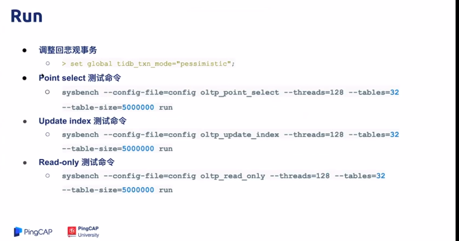
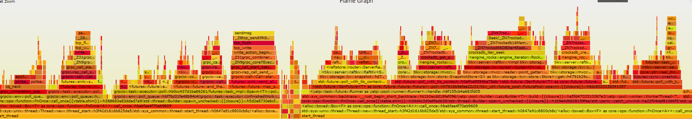
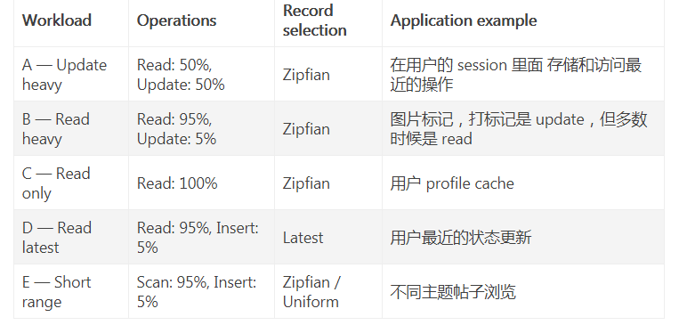

### 说明：

 > 本地md文档预览正确，在github出现大量下划线。
   还没找到那里的语法有问题。


### 题目

~~~shell
分值：300

题目描述：

使用 sysbench、go-ycsb 和 go-tpc 分别对
 TiDB 进行测试并且产出测试报告。

测试报告需要包括以下内容：
* 部署环境的机器配置(CPU、内存、磁盘规格型号)，拓扑结构(TiDB、TiKV 各部署于哪些节点)
* 调整过后的 TiDB 和 TiKV 配置
* 测试输出结果
* 关键指标的监控截图
	    * TiDB Query Summary 中的 qps 与 duration
	    * TiKV Details 面板中 Cluster 中各 server 的 CPU 以及 QPS 指标
	    * TiKV Details 面板中 grpc 的 qps 以及 duration

输出：写出你对该配置与拓扑环境和 workload 下 TiDB 集群负载的分析，
提出你认为的 TiDB 的性能的瓶颈所在(能提出大致在哪个模块即 可
~~~


### 机器配置

| 软件   | 版本           | 备注      |
| ------ | -------------- | --------- |
| Ubuntu | 18.04          | 虚拟机1个 |
| cpu    | Virtual CPU  3 |           |
| 内存   | 2G             |           |
|        |                |           |


面板：

http://www.mytidb.com:2379/dashboard/#/overview

http://www.mytidb.com:3000/

​        

### 测试方案1 （ 拓扑结构不变，增加线程数量）

> tiup cluster deploy tidb-test v4.0.0 ./topology1.yaml --user root -p

| 拓扑结构 | 个数 | 关键参数 |
| -------- | ---- | -------- |
| Tidb     | 1    |          |
| pd       | 1    | 同一个   |
| TiKV     | 1    | 同一个   |


####  sysbench



- 准备数据：

  sysbench --config-file=./sysbench-thread-1.cfg oltp_point_select --tables=16 --table-size=10000 prepare


- 测试结果

    sysbench --config-file=./sysbench-thread-1.cfg oltp_point_select --tables=16 --table-size=10000 run


> 非事务仅仅查询

| type         | thread | tps     | qps     | min latency | avg latency | 95th latency | max latency |
| ------------ | ------ | ------- | ------- | ----------- | ----------- | ------------ | ----------- |
| point_select | 1      | 1008.1  | 1008.1  | 0.42        | 0.99        | 1.7          | 44.97       |
| point_select | 3      | 2741.31 | 2741.31 | 0.37        | 1.09        | 2.26         | 39.55       |
| point_select | 8      | 3225.38 | 3225.38 | 0.37        | 2.48        | 6.91         | 62.25       |
| point_select | 16     | 3822.22 | 3822.22 | 0.4         | 4.18        | 17.63        | 87.57       |
| point_select | 32     | 4612.22 | 4612.22 | 0.4         | 6.93        | 17.63        | 87.64       |
| point_select | 64     | 4455.49 | 4455.49 | 0.48        | 14.35       | 34.95        | 132.55      |
| point_select | 128    | 5020.49 | 5020.49 | 0.48        | 25.45       | 56.84        | 182.4       |
| point_select | 256    | 5496.24 | 5496.24 | 0.53        | 46.47       | 99.33        | 306.11      |


> 第一步:观察规律


- 随着线程数量增加，虽然Qps增加，但是线程增加256倍，qps增加5倍，并且平均延迟逐渐增加。推测上下文切换造成的。


~~~shell
perf top
Samples: 1M of event 'cpu-clock', Event count (approx.): 42484621630                                                                                          
Overhead  Shared Object                 Symbol                                                                                                                
   3.80%  [kernel]                      [k] finish_task_switch                                                                                                
   3.58%  [kernel]                      [k] _raw_spin_unlock_irqrestore                                                                                       
   2.65%  tidb-server                   [.] runtime.scanobject                                                                                                
   2.44%  tidb-server                   [.] runtime.mallocgc                                                                                                  
   1.57%  tidb-server                   [.] runtime.findObject                                                                                                
   1.50%  tidb-server                   [.] runtime.heapBitsSetType                                                                                           
   1.33%  [kernel]                      [k] do_syscall_64                        
~~~


- 线程数超过内核数量3后，增加线程个数到256，依然增加qps，说明 非纯cpu操作

 **cpu**：

~~~shell
3个线程：

top - 18:56:05 up 6 days, 22:27,  2 users,  load average: 2.53, 1.68, 1.50
Tasks: 119 total,   2 running,  72 sleeping,   8 stopped,   0 zombie
%Cpu0  : 39.8 us, 22.5 sy,  0.0 ni, 32.6 id,  0.1 wa,  0.0 hi,  5.0 si,  0.0 st
%Cpu1  : 42.5 us, 21.2 sy,  0.0 ni, 30.5 id,  0.1 wa,  0.0 hi,  5.6 si,  0.0 st
%Cpu2  : 41.1 us, 21.1 sy,  0.0 ni, 31.3 id,  0.0 wa,  0.0 hi,  6.4 si,  0.0 st
KiB Mem :  2057260 total,   278420 free,  1231612 used,   547228 buff/cache
KiB Swap:   435652 total,   242040 free,   193612 used.   710760 avail Mem

256线程：
top - 18:57:23 up 6 days, 22:29,  2 users,  load average: 3.34, 2.11, 1.67
Tasks: 119 total,   1 running,  72 sleeping,   8 stopped,   0 zombie
%Cpu0  : 59.1 us, 25.7 sy,  0.0 ni,  8.1 id,  0.0 wa,  0.0 hi,  7.1 si,  0.0 st
%Cpu1  : 63.2 us, 23.8 sy,  0.0 ni,  6.1 id,  0.0 wa,  0.0 hi,  6.9 si,  0.0 st
%Cpu2  : 65.7 us, 21.1 sy,  0.0 ni,  5.5 id,  0.0 wa,  0.0 hi,  7.8 si,  0.0 st
KiB Mem :  2057260 total,    69648 free,  1439348 used,   548264 buff/cache
KiB Swap:   435652 total,   242040 free,   193612 used.   503260 avail Mem 
~~~


**性能分析**(对源码还不很了解，tidb内存数据库，依然消耗IO,可能在持久化方面原因)


Tikv：Flame Graph 停留在sendmsg ，在IO操作




从profiling_3_3_tikv_127_0_0_1_20160651773159.svg可以看到用到关键模块：
~~~shell
1. Raftstore：该模块里面我们会介绍 TiKV 如何使用 Raft，如何支持 Multi-Raft

- raftstore::store::worker::read::Lo


2. Storage，该模块里面我们会介绍 Multiversion concurrency control (MVCC)，基于 [Percolator](https://storage.googleapis.com/pub-tools-public-publication-data/pdf/36726.pdf) 的分布式事务的实现


- tikv::storage::mvcc::reader::point_getter::Poin


3. gRPC

​       -  grpc_call_start_batch~ExecCtx

4. *RocksDB*： is an embeddable persistent key-value store for fast storage
- _ZN7rocksdb16MemTableIterator4SeekERKNS_5SliceE


5. engine_rocks::snapshot：快照

~~~


Tidb： 部分截图

​


从截图可以看到用到关键模块：

1. tidb：server.go  监控连接 并且读取请求

2. executor 执行器相关逻辑

3. distsql：等待返回结果

4. [Session](https://github.com/pingcap/tidb/blob/source-code/session.go#L62)


> 采用默认脚本：/usr/local/share/sysbench
>
> sysbench-thread-1.cfg 执行 :%s/^M//g　来去掉^M ^M是使用 "CTRL-V CTRL-M"
>


####   go-ycsb

> 这里测试Database是TiKV

- 测试命令load &run 

  ~~~shell
  cd /data/tidb/src/github.com/pingcap/go-ycsb
  
  ./bin/go-ycsb load mysql -P ./workloads/workloada -p recordcount=10000 -p mysql.host=127.0.0.1 -p mysql.port=4000  -p mysql.user=root -p mysql.password=123456 -p mysql.db=test --threads 3
  
  ./bin/go-ycsb run mysql -P ./workloads/workloada -p recordcount=10000 -p mysql.host=127.0.0.1 -p mysql.port=4000  -p mysql.user=root -p mysql.password=123456 -p mysql.db=test --threads 3 
  ~~~

  

- 测试结果分析

1. 并发和延迟之间要均衡，workloada 当线程增加256时候，因为机器配置，性能反而下降。
2.  sql操作是IO操作，增加线程超过内核数量，依然可以发挥多线程优势。

- 测试数据

  


- 小白提问 

  1. 什么是workload负载类型  ？就是测试用例
  
~~~shell
  root@money:/data/tidb/src/github.com/pingcap/go-ycsb/workloads# ls
  minio  workloada  workloadb  workloadc  workloadd  workloade  workloadf  workload_template
~~~
  
  

2. ops是啥

> ops/sec 每秒操作数


####   go-tpc


- 测试分析：

1. 普通机器占用大量cpu 和io操作， Grafana上数据已经无法刷新 top 执行缓慢，后面改为sysbench测试。

2. 性能分析火焰显示 耗时比较大，**需要调整线程个数优化**，**磁盘存储方式需要优化**

   - gRPC 线程池是 TiKV 所有读写请求的总入口，它会把不同任务类型的请求转发给不同的线程池。

   ● Scheduler 线程池负责检测写事务冲突，把事务的两阶段提交、悲观锁上锁、事务回滚等请求转化为 key-value 对数组，然后交给 Store 线程进行 Raft 日志复制。

   ● Raftstore 线程池负责处理所有的 Raft 消息以及添加新日志的提议（Propose）、将日志写入到磁盘，当日志在 Raft Group 中达成多数一致（即 Raft 论文中描述的 Commit Index）后，它就会把该日志发送给 Apply 线程。

https://github.com/pingcap-incubator/tidb-in-action/blob/master/session4/chapter8/threadpool-optimize.md


- 测试数据

> warehouses 配置50 直接oom，调整为5

~~~shell
top：
%Cpu0  :  2.9 us, 45.3 sy,  0.0 ni,  0.5 id, 33.5 wa,  0.0 hi, 17.8 si,  0.0 st
%Cpu1  :  3.7 us, 34.9 sy,  0.0 ni,  3.3 id, 57.9 wa,  0.0 hi,  0.2 si,  0.0 st
%Cpu2  :  2.6 us, 40.4 sy,  0.0 ni,  0.7 id, 56.3 wa,  0.0 hi,  0.0 si,  0.0 st

%wa指CPU等待磁盘写入完成的时间

root@money:/data/tidb/src/github.com/pingcap/go-tpc# iostat -d 3
Linux 4.15.0-20-generic (money)         08/22/2020      _x86_64_        (3 CPU)

Device             tps    kB_read/s    kB_wrtn/s    kB_read    kB_wrtn
sda              20.35       827.41       187.53  633818569  143651781

Device             tps    kB_read/s    kB_wrtn/s    kB_read    kB_wrtn
sda            8337.66    477942.86        71.43    1472064        220

pidstat 2：

05:17:08 PM   UID       PID    %usr %system  %guest   %wait    %CPU   CPU  Command
05:17:12 PM     0         7    0.00    4.47    0.00    1.88    4.47     0  ksoftirqd/0
05:17:12 PM     0         8    0.00    0.71    0.00    4.94    0.71     2  rcu_sched
05:17:12 PM     0        48    0.00   84.24    0.00   13.41   84.24     0  kswapd0
05:17:12 PM     0       176    0.00    0.71    0.00    0.71    0.71     0  kworker/0:1H
05:17:12 PM     0       177    0.00    0.47    0.00    0.00    0.47     1  kworker/1:1H
05:17:12 PM     0       196    0.00    0.24    0.00    0.24    0.24     1  jbd2/sda2-8
05:17:12 PM     0       221    0.00    0.47    0.00    0.24    0.47     2  kworker/2:1H
05:17:12 PM     0       237    0.24    3.06    0.00   32.71    3.29     2  systemd-journal
05:17:12 PM     0       377    0.00    0.94    0.00   13.18    0.94     1  haveged
05:17:12 PM     0       466    0.24    2.59    0.00   29.88    2.82     1  supervisord
05:17:12 PM   106       511    0.00    5.18    0.00    0.00    5.18     0  mysqld
05:17:12 PM     0      1040    0.00    2.35    0.00   23.76    2.35     2  qemu-ga
05:17:12 PM     0      2931    0.00    0.71    0.00    1.88    0.71     2  ss-server
05:17:12 PM  1000      5904    1.41    8.24    0.00    0.00    9.65     1  pd-server
05:17:12 PM  1000      6046    0.24    9.65    0.00    0.00    9.88     0  node_exporter
05:17:12 PM     0      6048    0.00    0.24    0.00    1.41    0.24     1  kworker/1:5
05:17:12 PM  1000      6297    2.59   28.71    0.00    0.00   31.29     1  tikv-server
05:17:12 PM  1000      6891    0.94    8.47    0.00    0.00    9.41     1  tidb-server
05:17:12 PM  1000      7177    1.88    8.24    0.00    0.00   10.12     1  prometheus
05:17:12 PM  1000      7320    0.24    9.41    0.00    0.00    9.65     0  grafana-server
05:17:12 PM     0      7931    0.47    4.71    0.00   14.82    5.18     1  pidstat
05:17:12 PM     0      7933    0.24    2.59    0.00   29.88    2.82     2  TryEverything
05:17:12 PM     0      7934    0.00    2.82    0.00   30.59    2.82     1  cron
05:17:12 PM     0     25017    0.00    0.47    0.00    1.18    0.47     0  kworker/0:0
05:17:12 PM     0     26931    0.24    1.41    0.00    2.82    1.65     0  sshd
05:17:12 PM     0     27107    0.00    0.24    0.00    1.18    0.24     2  kworker/2:0

 vmstat 2
procs -----------memory---------- ---swap-- -----io---- -system-- ------cpu-----
 r  b   swpd   free   buff  cache   si   so    bi    bo   in   cs us sy id wa st
 0 24 435652  53104    996  35740    0    1   320    35   15   12  2  1 96  0  0
22  8 435652  53436    304  34956    0    0 364564    30 10720 12733  8 41  2 49  0
 0 31 435652  53172    256  36388    0    0 345682    36 9774 11017 13 51  1 35  0
 1 20 435652  53524    304  36220    0    0 371180   194 10769 12635  4 49  1 46  0
11 20 435652  52984    308  36208    0    0 307372    92 9960 12274  5 40  0 56  0
~~~


- 背景知识：


> TPC-C 是一个对 OLTP（联机交易处理）系统进行测试的规范，使用一个商品销售模型对 OLTP 系统进行测试，
>
> 其中包含五类事务：
>
> - NewOrder – 新订单的生成
> - Payment – 订单付款
> - OrderStatus – 最近订单查询
> - Delivery – 配送
> - StockLevel – 库存缺货状态分析


~~~powershell
git clone https://github.com/pingcap/go-tpc.git
make build

# Create 10 warehouses by HASH 
./bin/go-tpc tpcc -H 127.0.0.1  -P 4000 -U root -p 123456 -D tpcc --warehouses 5   prepare  -T 1 

# Run TPCC workloads, you can just run or add --wait option to including wait times
./bin/go-tpc tpcc -H 127.0.0.1  -P 4000 -U root -p 123456 -D tpcc --warehouses 5   run  -T 1 

# Cleanup
./bin/go-tpc tpcc --warehouses 50 cleanup

内存不够：
warehouses= 50 cpu 100%利用，不能在高了
execute prepare failed, err load stock at warehouse 40 failed Error 9002: TiKV server timeout
pd server 直接 core

tiup cluster display tidb-test


Starting component `cluster`: /root/.tiup/components/cluster/v1.0.9/tiup-cluster display tidb-test
tidb Cluster: tidb-test
tidb Version: v4.0.0
ID               Role        Host       Ports        OS/Arch       Status      Data Dir                                   Deploy Dir
--               ----        ----       -----        -------       ------      --------                                   ----------
127.0.0.1:3000   grafana     127.0.0.1  3000         linux/x86_64  Up          -                                          /data/tidb/tiup/tidb-deploy/grafana-3000
127.0.0.1:2379   pd          127.0.0.1  2379/2380    linux/x86_64  Down        /data/tidb/tiup/tidb-data/pd-2379          /data/tidb/tiup/tidb-deploy/pd-2379
127.0.0.1:9090   prometheus  127.0.0.1  9090         linux/x86_64  activating  /data/tidb/tiup/tidb-data/prometheus-9090  /data/tidb/tiup/tidb-deploy/prometheus-9090
127.0.0.1:4000   tidb        127.0.0.1  4000/10080   linux/x86_64  Up          -                                          /data/tidb/tiup/tidb-deploy/tidb-4000
127.0.0.1:20160  tikv        127.0.0.1  20160/20180  linux/x86_64  Down        /data/tidb/tiup/tidb-data/tikv-20160       /data/tidb/tiup/tidb-deploy/tikv-20160
[ 7849.183484] Out of memory: Kill process 14859 (rustc) score 579 or sacrifice child
[ 7849.183715] Killed process 14859 (rustc) total-vm:2032712kB, anon-rss:1299156kB, file-rss:0kB, shmem-rss:0kB
[ 7849.324714] oom_reaper: reaped process 14859 (rustc), now anon-rss:0kB, file-rss:0kB, shmem-rss:0kB


Usage:
  go-tpc [command]

  -D, --db string           Database name (default "test")
  -H, --host string         Database host (default "127.0.0.1")
  -p, --password string     Database password
  -P, --port int            Database port (default 4000)
  -U, --user string         Database user (default "root")

  mysql -h 127.0.0.1 -P 4000 -u root  -p 
  SET PASSWORD FOR 'root'@'%' = '123456'
  
~~~


- 内部不足OOM 需要重启


```bash
tiup cluster deploy tidb-test v4.0.0 ./topology1.yaml --user root -p ##部署
tiup cluster start tidb-test ##别忘记启动呀！！！

tiup cluster display tidb-test  ##查询
tiup cluster list ##查询
tiup cluster start tidb-test

tiup cluster start tidb-test  -R pd ## 单独启动
 
tiup cluster stop tidb-test
tiup cluster destroy tidb-test
retry error: operation timed out after 2m0s
        tikv 127.0.0.1:20160 failed to start: timed out waiting for port 20160 to be started after 2m0s, please check the log of the instance

Error: failed to start tikv:    tikv 127.0.0.1:20160 failed to start: timed out waiting for port 20160 to be started after 2m0s, please check the log of the instance: timed out waiting for port 20160 to be started after 2m0s

Verbose debug logs has been written to /root/logs/tiup-cluster-debug-2020-08-22-15-29-57.log.

```


- 面板参数含义理解

https://asktug.com/_/tidb-performance-map/#/tikv


### 测试方案 2  调整拓扑配置。


> 预期输出：
>
> 1. 通过观察gRPC 一直停留send中，存在IO阻塞，对cpu消耗不是很大。
>
>    本机内核默认3核，什么做请看下存在2k-9k上下去切换，存在大量cpu io wa ，线程个数server.grpc-concurrency 为2，
>
> 2. raftstore等IO操作执行shell等其他命令存在卡顿，写入磁盘策略从强制将数据刷到磁盘改为
> 3. 本地调整至调整TiKV ，其他不需要调整。 
> 4. 配置模板 https://github.com/pingcap/docs-cn/tree/master/config-templates


- 参数含义

~~~shell
server_configs:
  tikv:
    server.grpc-concurrency: 2
    raftstore.sync-log:false
    # raftstore.apply-pool-size: 2
    # raftstore.store-pool-size: 2
    # rocksdb.max-sub-compactions: 1
    # storage.block-cache.capacity: "16GB"
    # readpool.unified.max-thread-count: 12
    readpool.storage.use-unified-pool: false
    readpool.coprocessor.use-unified-pool: true

https://asktug.com/t/topic/33426
sync-log 默认为 true，表示强制将数据刷到磁盘上；
通过使用 Raft 一致性算法，数据在各 TiKV 节点间复制为多副本，以确保某个节点挂掉时数据的安全性。
只有当数据已写入超过 50% 的副本时，应用才返回 ACK（三副本中的两副本）。但理论上两个节点也可能同时发生故障，所以除非是对性能要求高于数据安全的场景，一般都强烈推荐开启 sync-log。一般来说，开启 sync-log 会让性能损耗 30% 左右。
~~~


### 遗留TODO

- TiKV面板以前没使用过，里面好多功能参数，需要你研究一下。和源码结合起来
- 8.2.1 TiKV 线程池优化
- [TiKV 内存参数性能调优](https://docs.pingcap.com/zh/tidb/dev/tune-tikv-memory-performance)


### 参考

- [性能排查手册](https://asktug.com/_/tidb-performance-map)

- 第8章 TiDB 调优指南

- TiDB 源码阅读系列文章

- [如何对 TiDB 进行 TPC-C 测试](https://docs.pingcap.com/zh/tidb/v3.0/benchmark-tidb-using-tpcc)

- [TiKV 性能参数调优](https://docs.pingcap.com/zh/tidb/v3.0/tune-tikv-performance)

- [TiUP 常见运维操作](https://docs.pingcap.com/zh/tidb/stable/maintain-tidb-using-tiup)

- 如何读懂火焰图？

  

  