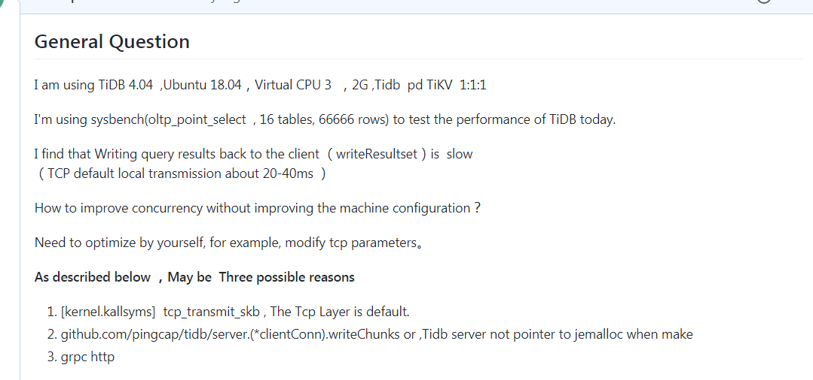
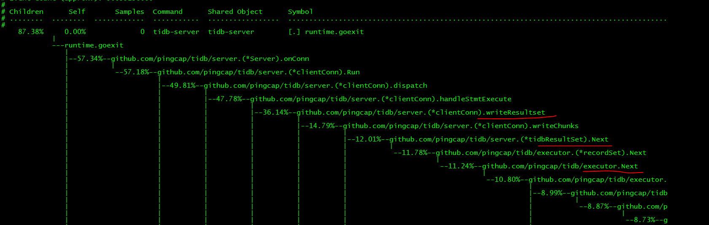
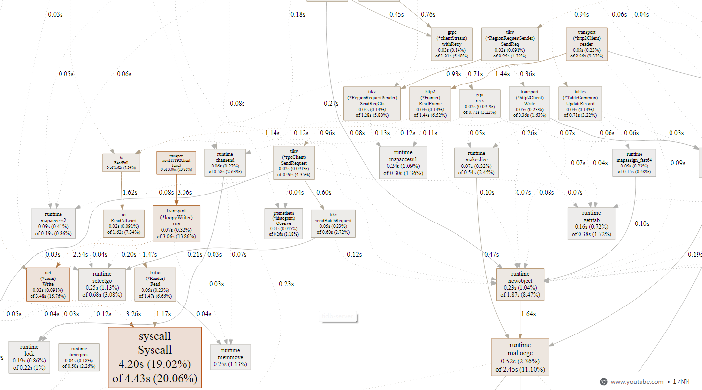
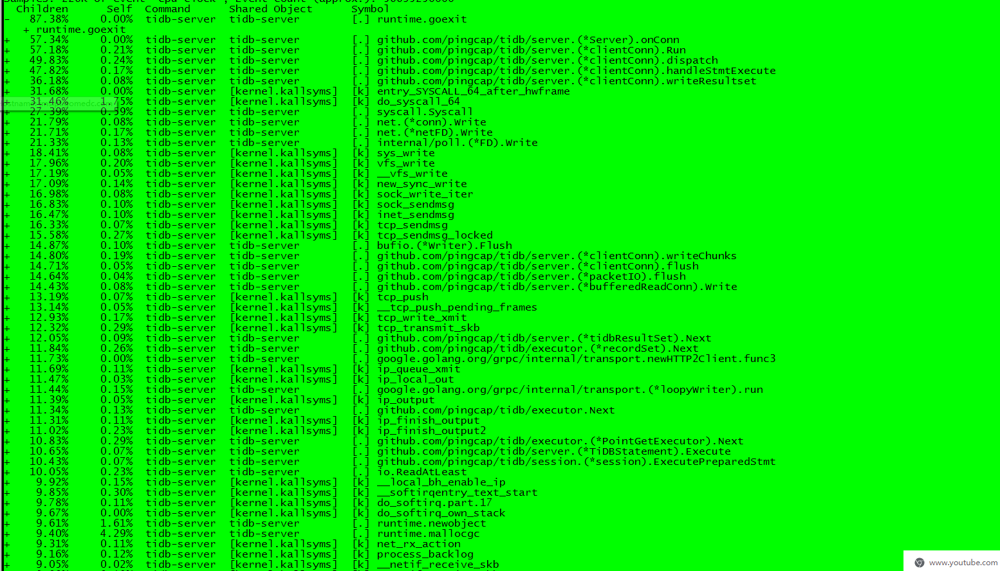
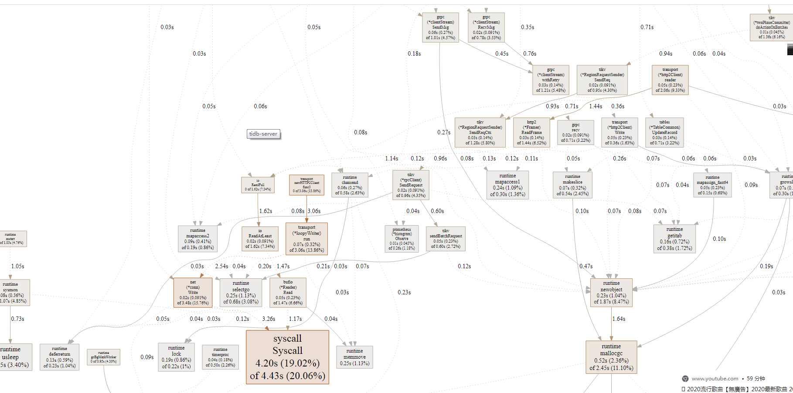
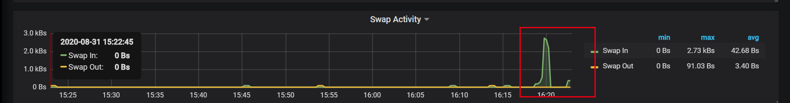
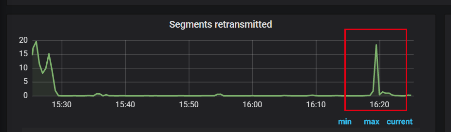
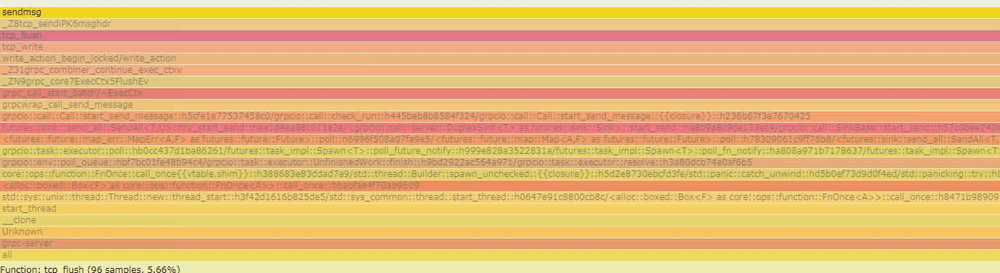

### 题目描述：


使用上一节可以讲的 sysbench、go-ycsb 或者 go-tpc 对 TiDB 进行压力测试，然后对 TiDB 或 TiKV 的 CPU 、内存或 IO 进行 profile，寻找潜在可以优化的地方并提 enhance 类型的 issue 描述。

issue 描述应包含：
* 部署环境的机器配置（CPU、内存、磁盘规格型号），拓扑结构（TiDB、TiKV 各部署于哪些节点）
* 跑的 workload 情况
* 对应的 profile 看到的情况
* 建议如何优化？
* 【可选】提 PR 进行优化：按照 PR 模板提交优化 PR


### 作业输出

https://github.com/pingcap/tidb/issues/19626

问：在不提高单核 cpu 的能力，或增加 tikv数量情况下，如果提高Tidb能力？

writeResultset 函数瓶颈点：

TiDB 在内部处理数据是一批一批的，到了发送结果给客户端时，是一行一行的。

 需要把一个 chunk 的数据按行转换成 MySQL 的编码格式了发送出去。 


优化点：tpc内核传输，利用好滑动窗口，因为出现了tcp_transmit_skb  大量提示


> 查询数据，虽然tidb Chunks (TiDB 在内部处理数据是一批一批)
>
> 但是 返回给客户端 是一行一行发送的( 需要把一个 chunk 的数据按行转换成 MySQL 的编码格式了发送出去)
>
> 优化的：tpc内核传输，利用好滑动窗口，因为出现了tcp_transmit_skb  大量提示。
>
> https://dev.mysql.com/doc/internals/en/com-query-response.html
>
> 




| 拓扑结构 | 个数 | 关键参数              |
| -------- | ---- | --------------------- |
| Tidb     | 1    | 同一个主机 ，最低参数 |
| pd       | 1    | 同一个主机，最低参数  |
| TiKV     | 1    | 同一个主机，最低参数  |

| 软件   | 版本           | 备注      |
| ------ | -------------- | --------- |
| Ubuntu | 18.04          | 虚拟机1个 |
| cpu    | Virtual CPU  3 |           |
| 内存   | 2G             |           |
| 磁盘   | 普通           |           |


### 目前看出可以优化地方：


- 可选优化 epoll 处理方式ET 改为LT P [read，减少一次系统调用]

~~~shell
86943.325 ( 0.010 ms): tidb-server/16285 read(fd: 28<socket:[6332591]>, buf: 0xc0027dc000, count: 16384        ) = -1 EAGAIN Resource temporarily unavailable
186943.390 ( 0.054 ms): tidb-server/16285 write(fd: 22<socket:[6334511]>, buf: 0xc0023bc000, count: 195         ) = 195
186943.503 ( 0.009 ms): tidb-server/16285 read(fd: 22<socket:[6334511]>, buf: 0xc002382000, count: 16384        ) = -1 EAGAIN Resource temporarily unavailable
186943.558 ( 0.052 ms): tidb-server/16285 write(fd: 25<socket:[6324243]>, buf: 0xc002556000, count: 195         ) = 195

~~~


- 源码编译时候，分析tidbserver发现runtime 耗时比较长。TiKV编译时候采用(tcmalloc jemalloc glibc),tidb server好像没有明确。


~~~
https://pingcap.com/blog-cn/flame-graph/
TiKV 是自己内部使用了 jemalloc，并没有用系统的 malloc，所以我们不能直接用 perf 来探查系统的 malloc 函数。幸运的是，perf 能支持动态添加探针，我们将 TiKV 的 malloc 加入：

Copy
perf probe -x /deploy/bin/tikv-server -a malloc
然后采样生成火焰图:

perf record -e probe_tikv:malloc -F 99 -p tikv_pid -g -- sleep 10
perf script > out.perf
/opt/FlameGraph/stackcollapse-perf.pl out.perf > out.folded
/opt/FlameGraph/flamegraph.pl  --colors=mem out.folded > mem.svg
~~~


-  gprc 关于 future 切换 和系统调用方面 正在看，具体在代码分析上。


>TiDB 在内部处理数据是一批一批的，到了发送结果给客户端时，是一行一行的。

> 需要把一个 chunk 的数据按行转换成 MySQL 的编码格式了发送出去。 

> MySQL 的消息包的编码格式可以在这里找到 https://dev.mysql.com/doc/internals/en/com-query-response.html


## 一、测试结果分析

根据 对<测试数据分析> 

- Tidb_server **36.18%**时间在writeResultset , 程序停留在不是SQL执行过程，而是SQL发送到客户端过程中

  > 本次压测范围是查询，**Select 语句需要返回结果集** 考验的是TidbServer 
  >
  > （insert 考验的是tikvServer 和磁盘 TiKV raftstore）。
>
  > 运行 sysbench oltp 测试， sysbench 默认 oltp 一个事务包含 18 条 SQL:
>
  > ```
> 10 * point select
  > 1 * simple range select
  > 1 * sum range
  > 1 * order range
  > 1 * distinct range
  > 1 * index update
> 1 * non index update
  > 1 * insert
> 1 * deletetcp
  > 
> 
  > 传输 不跨机器传输一般20ms完成，这里消耗40ms(包括gcc申请内存时间，自己没有采用jemalloc)
> ```
  
**这说明发送数据到客户端可能存在瓶颈问题** 【具体过程需要看代码解决】
  
```go
  	857:		err = cc.writeResultset(goCtx, rs[0], false, false)  
  	// SQL 核心层 拿到 SQL 语句的结果后会调用 writeResultset 方法把结果写回客户端
  ```
  
  
  具体来说 :跟系统的内核SKB ,tidb-server executor执行批量writeChunks有关系。  bufio.(*Writer).Flush 
  
  [kernel.kallsyms]  [k] sock_sendmsg  
  
  ---->tidb-server        [.] github.com/pingcap/tidb/server.(*clientConn).writeChunks
  
  --->[kernel.kallsyms]  [k] tcp_transmit_skb 
  
  --->[kernel.kallsyms]  [k] __netif_receive_skb_cor
  
  




tcp_transmit_skb 


查询 http://www.brendangregg.com/perf.html 搜索关键字tcp_transmit_skb 【后面继续了解】


- 通过耗时分析 主要停留在系统调用读写 

- gprc   future task 导致的频繁线程切换 

  

  gprc  session：查询需要分配内存 和批量buffer等

  系统调用：read send接口（跟我虚拟机有关系tcp_transmit_skb）

  

  

搜索历史bug

https://github.com/pingcap/tidb/issues/17749

https://asktug.com/t/topic/1333


## 二、具体代码分析

> 具体函数执行结合profie和strace  gdb 进行单步跟踪。


- 重点关注从执行引擎到返回客户端这一段、**跟网络发送有关系**。

  


- TiDB 的执行引擎，**跟磁盘有读写有关系**


[TiDB 源码阅读系列文章（六）Select 语句概览](https://pingcap.com/blog-cn/tidb-source-code-reading-6/)

- [Session](https://github.com/pingcap/tidb/blob/source-code/session.go#L62)
- [RecordSet](https://github.com/pingcap/tidb/blob/source-code/ast/ast.go#L136)
- [Plan](https://github.com/pingcap/tidb/blob/source-code/plan/plan.go#L30)
- [LogicalPlan](https://github.com/pingcap/tidb/blob/source-code/plan/plan.go#L140)
- [PhysicalPlan](https://github.com/pingcap/tidb/blob/source-code/plan/plan.go#L190)
- [Executor](https://github.com/pingcap/tidb/blob/source-code/executor/executor.go#L190)

相比 Insert 的处理流程，Select 的处理流程中有 3 个明显的不同：

1. 需要经过 Optimize

   Insert 是比较简单语句，在查询计划这块并不能做什么事情（对于 Insert into Select 语句这种，实际上只对 Select 进行优化），而 Select 语句可能会无比复杂，不同的查询计划之间性能天差地别，需要非常仔细的进行优化。

   ```go
   logicalOptimize //逻辑优化
   dagPhysicalOptimize //物理优化
   
   mysql> explain select * from teacher where age >=18; //explain 执行结果和sql不太一样。
   +-------------------------+----------+-----------+---------------+--------------------------------+
   | id                      | estRows  | task      | access object | operator info                  |
   +-------------------------+----------+-----------+---------------+--------------------------------+
   | TableReader_7           | 3333.33  | root      |               | data:Selection_6               |
   | └─Selection_6           | 3333.33  | cop[tikv] |               | ge(test.teacher.age, 18)       |
   |   └─TableFullScan_5     | 10000.00 | cop[tikv] | table:teacher | keep order:false, stats:pseudo |
   +-------------------------+----------+-----------+---------------+--------------------------------+
   ```

2. 需要和存储引擎中的计算模块交互

   Insert 语句只涉及对 Key-Value 的 Set 操作，Select 语句可能要查询大量的数据，

   

   如果通过 KV 接口操作存储引擎，会过于低效，必须要通过计算下推的方式，将计算逻辑发送到存储节点，就近进行处理。

   

3. 需要对客户端返回结果集数据

   Insert 语句只需要返回是否成功以及插入了多少行即可，**而 Select 语句需要返回结果集**。【here】


- ### 边读磁盘，边发送网络

合并结果：

在 TiDB 中，计算是以 Region 为单位进行，SQL 层会分析出要处理的数据的 Key Range，再将这些 Key Range 根据 PD 中拿到的 Region 信息划分成若干个 Key Range，最后将这些请求发往对应的 Region。

SQL 层会将多个 Region 返回的结果进行汇总，再经过所需的 Operator 处理，生成最终的结果集。

```go
// SelectResult is an iterator of coprocessor partial results.
type SelectResult interface {
	// NextRaw gets the next raw result.
	NextRaw(goctx.Context) ([]byte, error)
	// NextChunk reads the data into chunk.
	NextChunk(goctx.Context, *chunk.Chunk) error
	// Close closes the iterator.
	Close() error
	// Fetch fetches partial results from client.
	// The caller should call SetFields() before call Fetch().
	Fetch(goctx.Context)
	// ScanKeys gets the total scan row count.
	ScanKeys() int64
```


- writeResultset【代码】

~~~go
// writeResultset writes data into a resultset and uses rs.Next to get row data back.
// If binary is true, the data would be encoded in BINARY format.
// serverStatus, a flag bit represents server information.
// fetchSize, the desired number of rows to be fetched each time when client uses cursor.
func (cc *clientConn) writeResultset(ctx context.Context, rs ResultSet, binary bool, serverStatus uint16, fetchSize int) (runErr error) {
	defer func() {
		// close ResultSet when cursor doesn't exist
		r := recover()
		if r == nil {
			return
		}
		if str, ok := r.(string); !ok || !strings.HasPrefix(str, memory.PanicMemoryExceed) {
			panic(r)
		}
		// TODO(jianzhang.zj: add metrics here)
		runErr = errors.Errorf("%v", r)
		buf := make([]byte, 4096)
		stackSize := runtime.Stack(buf, false)
		buf = buf[:stackSize]
		logutil.Logger(ctx).Error("write query result panic", zap.Stringer("lastSQL", getLastStmtInConn{cc}), zap.String("stack", string(buf)))
	}()
	var err error
	if mysql.HasCursorExistsFlag(serverStatus) {
		err = cc.writeChunksWithFetchSize(ctx, rs, serverStatus, fetchSize)
	} else {
		err = cc.writeChunks(ctx, rs, binary, serverStatus)
	}
	if err != nil {
		return err
	}

	return cc.flush()
}


// Chunk stores multiple rows of data in Apache Arrow format.
// See https://arrow.apache.org/docs/memory_layout.html
// Values are appended in compact format and can be directly accessed without decoding.
// When the chunk is done processing, we can reuse the allocated memory by resetting it.
type Chunk struct {
	columns []*column
	// numVirtualRows indicates the number of virtual rows, witch have zero columns.
	// It is used only when this Chunk doesn't hold any data, i.e. "len(columns)==0".
	numVirtualRows int
}
~~~


### 正在看这个函数的实现 writeChunks注释版本


~~~go
// writeChunks writes data from a Chunk, which filled data by a ResultSet, into a connection.
// binary specifies the way to dump data. It throws any error while dumping data.
// serverStatus, a flag bit represents server information
func (cc *clientConn) writeChunks(ctx context.Context, rs ResultSet, binary bool, serverStatus uint16) error {
	data := cc.alloc.AllocWithLen(4, 1024)
	req := rs.NewChunk()
	gotColumnInfo := false
	var stmtDetail *execdetails.StmtExecDetails
	stmtDetailRaw := ctx.Value(execdetails.StmtExecDetailKey)
	if stmtDetailRaw != nil {
		stmtDetail = stmtDetailRaw.(*execdetails.StmtExecDetails)
	}

	for {
		// Here server.tidbResultSet implements Next method.
        //类似mysql一样 ，一行一行获取记录
		err := rs.Next(ctx, req)
		if err != nil {
			return err
		}
		if !gotColumnInfo {
			// We need to call Next before we get columns.
			// Otherwise, we will get incorrect columns info.
			columns := rs.Columns()
			err = cc.writeColumnInfo(columns, serverStatus)
			if err != nil {
				return err
			}
			gotColumnInfo = true
		}
		rowCount := req.NumRows()
		if rowCount == 0 {
			break
		}
		start := time.Now()
        //这是一行一行发送的？？？？
		for i := 0; i < rowCount; i++ {
			data = data[0:4]
			if binary {
				data, err = dumpBinaryRow(data, rs.Columns(), req.GetRow(i))
			} else {
				data, err = dumpTextRow(data, rs.Columns(), req.GetRow(i))
			}
			if err != nil {
				return err
			}
            //发送网络包
			if err = cc.writePacket(data); err != nil {
				return err
			}
		}
		if stmtDetail != nil {
			stmtDetail.WriteSQLRespDuration += time.Since(start)
		}
	}
	return cc.writeEOF(serverStatus)
}

~~~


### Mysql协议


https://dev.mysql.com/doc/internals/en/com-query-response.html

https://asktug.com/t/topic/36939


## 三、测试数据

### TIDB


~~~shell
root@money:/data/tidb/tiup/perf# perf report
Samples: 226K of event 'cpu-clock', Event count (approx.): 56695250000                                                                                                        
  Children      Self  Command      Shared Object      Symbol                                                                                                                  
+   87.38%     0.00%  tidb-server  tidb-server        [.] runtime.goexit                                                                                                      
+   57.34%     0.00%  tidb-server  tidb-server        [.] github.com/pingcap/tidb/server.(*Server).onConn                                                                     
+   57.18%     0.21%  tidb-server  tidb-server        [.] github.com/pingcap/tidb/server.(*clientConn).Run                                                                    
+   49.83%     0.24%  tidb-server  tidb-server        [.] github.com/pingcap/tidb/server.(*clientConn).dispatch                                                               
+   47.82%     0.17%  tidb-server  tidb-server        [.] github.com/pingcap/tidb/server.(*clientConn).handleStmtExecute                                                      
+   36.18%     0.08%  tidb-server  tidb-server        [.] github.com/pingcap/tidb/server.(*clientConn).writeResultset                                                         
+   31.68%     0.00%  tidb-server  [kernel.kallsyms]  [k] entry_SYSCALL_64_after_hwframe                                                                                      
+   31.46%     1.75%  tidb-server  [kernel.kallsyms]  [k] do_syscall_64                                                                                                       
+   27.39%     0.59%  tidb-server  tidb-server        [.] syscall.Syscall                                                                                                     
+   21.79%     0.08%  tidb-server  tidb-server        [.] net.(*conn).Write                                                                                                   
+   21.71%     0.17%  tidb-server  tidb-server        [.] net.(*netFD).Write                                                                                                  
+   21.33%     0.13%  tidb-server  tidb-server        [.] internal/poll.(*FD).Write                                                                                           
+   18.41%     0.08%  tidb-server  [kernel.kallsyms]  [k] sys_write                                                                                                           
+   17.96%     0.20%  tidb-server  [kernel.kallsyms]  [k] vfs_write                                                                                                           
+   17.19%     0.05%  tidb-server  [kernel.kallsyms]  [k] __vfs_write                                                                                                         
+   17.09%     0.14%  tidb-server  [kernel.kallsyms]  [k] new_sync_write                                                                                                      
+   16.98%     0.08%  tidb-server  [kernel.kallsyms]  [k] sock_write_iter                                                                                                     
+   16.83%     0.10%  tidb-server  [kernel.kallsyms]  [k] sock_sendmsg                                                                                                        
+   16.47%     0.10%  tidb-server  [kernel.kallsyms]  [k] inet_sendmsg                                                                                                        
+   16.33%     0.07%  tidb-server  [kernel.kallsyms]  [k] tcp_sendmsg                                                                                                         
+   15.58%     0.27%  tidb-server  [kernel.kallsyms]  [k] tcp_sendmsg_locked                                                                                                  
+   14.87%     0.10%  tidb-server  tidb-server        [.] bufio.(*Writer).Flush                                                                                               
+   14.80%     0.19%  tidb-server  tidb-server        [.] github.com/pingcap/tidb/server.(*clientConn).writeChunks                                                            
+   14.71%     0.05%  tidb-server  tidb-server        [.] github.com/pingcap/tidb/server.(*clientConn).flush                                                                  
+   14.64%     0.04%  tidb-server  tidb-server        [.] github.com/pingcap/tidb/server.(*packetIO).flush                                                                    
+   14.43%     0.08%  tidb-server  tidb-server        [.] github.com/pingcap/tidb/server.(*bufferedReadConn).Write                                                            
+   13.19%     0.07%  tidb-server  [kernel.kallsyms]  [k] tcp_push                                                                                                            
+   13.14%     0.05%  tidb-server  [kernel.kallsyms]  [k] __tcp_push_pending_frames                                                                                           
+   12.93%     0.17%  tidb-server  [kernel.kallsyms]  [k] tcp_write_xmit                                                                                                      
+   12.32%     0.29%  tidb-server  [kernel.kallsyms]  [k] tcp_transmit_skb                                                                                                    
+   12.05%     0.09%  tidb-server  tidb-server        [.] github.com/pingcap/tidb/server.(*tidbResultSet).Next                                                                
+   11.84%     0.26%  tidb-server  tidb-server        [.] github.com/pingcap/tidb/executor.(*recordSet).Next                                                                  
+   11.73%     0.00%  tidb-server  tidb-server        [.] google.golang.org/grpc/internal/transport.newHTTP2Client.func3                                                      
+   11.69%     0.11%  tidb-server  [kernel.kallsyms]  [k] ip_queue_xmit                                                                                                       
+   11.47%     0.03%  tidb-server  [kernel.kallsyms]  [k] ip_local_out                                                                                                        
+   11.44%     0.15%  tidb-server  tidb-server        [.] google.golang.org/grpc/internal/transport.(*loopyWriter).run                                                        
+   11.39%     0.05%  tidb-server  [kernel.kallsyms]  [k] ip_output                                                                                                           
+   11.34%     0.13%  tidb-server  tidb-server        [.] github.com/pingcap/tidb/executor.Next                                                                               
+   11.31%     0.11%  tidb-server  [kernel.kallsyms]  [k] ip_finish_output                                                                                                    
+   11.02%     0.23%  tidb-server  [kernel.kallsyms]  [k] ip_finish_output2                                                                                                   
+   10.83%     0.29%  tidb-server  tidb-server        [.] github.com/pingcap/tidb/executor.(*PointGetExecutor).Next
~~~


x

- profile/profiling_2_2_tidb_127_0_0_1_4000664362528.svg



- 内存swap







### tikv  更多数据在perf目录下





## 测试过程过程

sysbench：

cd /data/tidb/tiup

- 准备数据：

  sysbench --config-file=./sysbench-thread-1.cfg oltp_point_select --tables=16 --table-size=10000 prepare


- 测试结果

  sysbench --config-file=./sysbench-thread-1.cfg oltp_point_select --tables=3 --table-size=66666 run


perf record   -g -p 30584
perf report -n --stdio

perf script -i  ./perf.data | /data/tidb/src/github.com/FlameGraph/stackcollapse-perf.pl --all |  /data/tidb/src/github.com/FlameGraph/flamegraph.pl > tidb_16.svg


cd /data/tidb/tiup/tidb-deploy/tidb-4000/log

- 了解 系统调用

~~~
# pstack命令可显示每个进程的栈跟踪
sudo apt-get install pstack strace
pstack  16281


strace -p  16281
strace -p 16281  -tt -T -o ./strace.log
mysql -h 127.0.0.1 -P 4000 -u root  -p 
~~~


### 基础知识补充


~~~c++
http://www.mytidb.com:2379/dashboard/


# 安装perf
yum clean all
yum makecache
yum update 

画外音：
有可能失败,需要删除目录/etc/yum.repos.d/, xxx.repo 下不合理的,放心删除替换就可以。
CentOS 6
wget -O /etc/yum.repos.d/CentOS-Base.repo http://mirrors.aliyun.com/repo/Centos-6.repo
curl -o /etc/yum.repos.d/CentOS-Base.repo http://mirrors.aliyun.com/repo/Centos-6.repo

yum install perf 


strace -p 25817 -c
mpstat -P ALL 3

# 火焰图
git clone https://github.com/brendangregg/FlameGraph
cd FlameGraph    
perf script -i /root/perf.data | /data/tidb/src/github.com/FlameGraph/stackcollapse-perf.pl --all |  /data/tidb/src/github.com/FlameGraph/flamegraph.pl > ksoftirqd.svg
  
    

# 执行perf记录事件
# -g：启用进程中函数的调用关系（CPU使用超过0.5%时，才会显示调用栈，可以通过man查看）
# -a：追踪所有的CPU的
perf record   -g -p 30584
perf report -n --stdio
    
# 切换到FlameGraph安装路径执行下面的命令生成火焰图
$ perf script -i  perf.data | ./stackcollapse-perf.pl --all | ./flamegraph.pl > nginx.svg
    

# -S参数表示设置TCP协议的SYN（同步序列号），-p表示目的端口为80
# -i u10表示每隔10微秒发送一个网络帧
# 注：如果你在实践过程中现象不明显，可以尝试把10调小，比如调成5甚至1
yum install hping3
$ hping3 -S -p 8081 -i u10 127.0.0.1

# -n DEV 表示显示网络收发的报告，间隔1秒输出一组数据
$ sar -n DEV 1

    
    
# 安装必备docker、curl和perf
$ apt-get install -y docker.io curl build-essential linux-tools-common
# 安装火焰图工具
$ git clone https://github.com/brendangregg/FlameGraph
# 安装wrk
$ git clone https://github.com/wg/wrk
$ cd wrk && make && sudo cp wrk /usr/local/bin/
    

git clone https://github.com/wg/wrk.git  
cd wrk  
make 
    
# 默认测试时间为10s，请求超时2s
$ wrk --latency -c 1000 http://127.0.0.1:8081
 

# 测试时间5分钟
$ wrk --latency -c 1000 -d 300 http://192.168.0.30

Running 10s test @ http://192.168.0.30
  2 threads and 1000 connections
  Thread Stats   Avg      Stdev     Max   +/- Stdev
    Latency    14.82ms   42.47ms 874.96ms   98.43%
    Req/Sec   550.55      1.36k    5.70k    93.10%
  Latency Distribution
     50%   11.03ms
     75%   15.90ms
     90%   23.65ms
     99%  215.03ms
  1910 requests in 10.10s, 573.56KB read
  Non-2xx or 3xx responses: 1910
Requests/sec:    189.10
Transfer/sec:     56.78KB
~~~


### 基础知识补充 pprof 


~~~

http://95.169.24.121:10080/debug/pprof/


#  TiDB 内存快照分析
go tool pprof 127.0.0.1:10080/debug/pprof/heap
curl -G 127.0.0.1:10080/debug/pprof/heap > heap.profile

go tool pprof heap.profile


登录 Dashboard 后，可在左侧功能导航处点击「高级调试 → 节点性能分析」进入性能分析页面。

选择一个或多个需要进行性能分析的节点，并选择性能分析时长(默认为 30 秒，最多 120 秒)，点击「开始分析」，即可开始性能分析。
 
# pstack命令可显示每个进程的栈跟踪
sudo apt-get install pstack strace
pstack  16281
strace -p  16281
~~~


## ref
- TiDB 源码阅读系列文章（六）Select 语句概览

- TiDB 源码阅读系列文章（三）SQL 的一生

- https://time.geekbang.org/column/article/87342

- 专栏 Linux 性能优化实战 https://github.com/feiskyer/linux-perf-examples

- [Golang 大杀器之性能剖析 PProf](https://segmentfault.com/a/1190000016412013) 阅读耗时

- 性能调优攻略 https://coolshell.cn/articles/7490.html

- Golang 大杀器之跟踪剖析 trace  阅读 40分钟 [Golang 大杀器之跟踪剖析 trace](https://juejin.im/post/6844903887757901831)

  

  